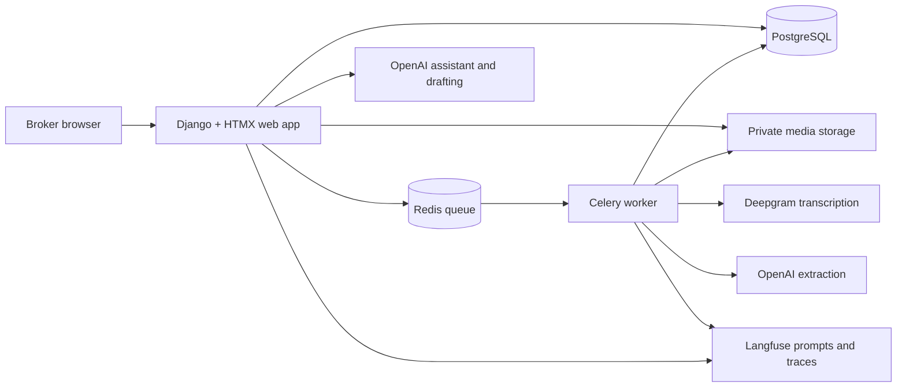
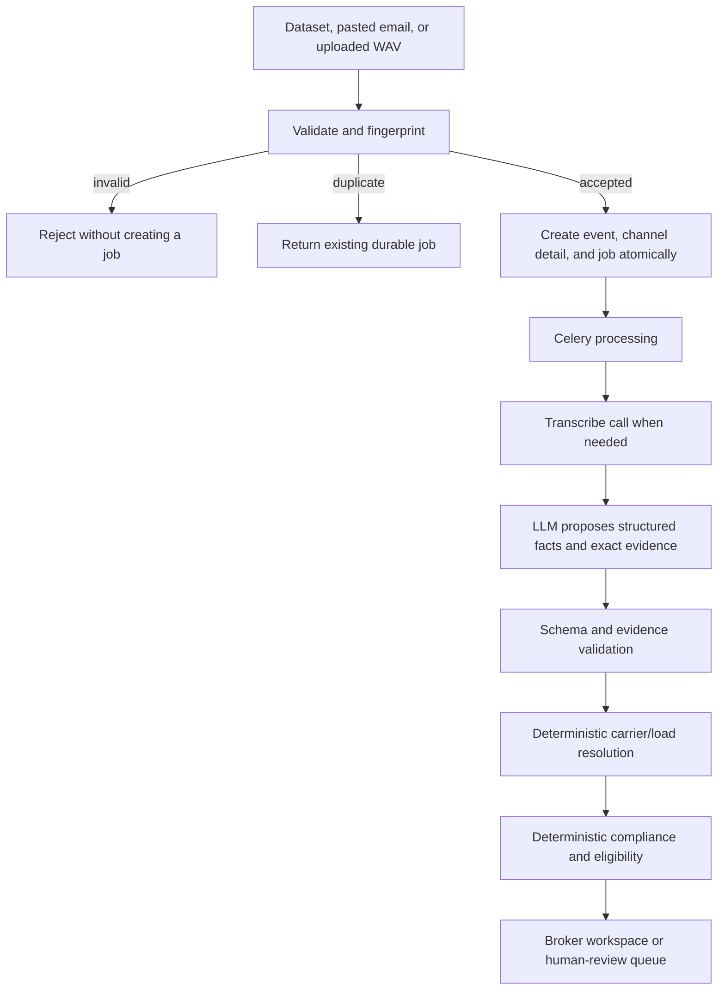

# Goodlane Freight Carrier Agent

An AI-assisted workspace that turns messy carrier emails and call recordings into
structured, evidence-linked freight inquiries. It helps a broker compare carriers,
understand rates and compliance, resolve uncertain matches, and draft a grounded
reply while keeping the broker as the final decision-maker.

This repository is a take-home POC for the Goodlane Founding Engineer interview.
This README is the reviewer handover: start here for the live demo, product tour,
architecture, evaluation, local setup, and deliberate production tradeoffs.

## Live demo

- **Application:** [carrier-agent-production.up.railway.app](https://carrier-agent-production.up.railway.app/)
- **Demo email:** `broker@goodlanelogistics.com`
- **Password:** shared separately with reviewers; it is never committed to Git
- **Business clock:** May 25, 2026, so dataset-relative dates remain reproducible
- **Safety boundary:** the POC never contacts a carrier, sends an email, accepts a
  rate, or books capacity. It prepares evidence and recommendations for a broker.

### Recommended five-minute walkthrough

1. Start on the **Dashboard** to establish the operational and AI health picture.
2. Open **Inbox**, filter to calls, and choose an item marked **Needs review**.
3. In **Inquiry Review**, play the recording, compare the transcript and exact
   evidence, inspect the extracted fields, and open its Langfuse trace.
4. Follow the load link into **Load Workspace** to compare the market band, the
   lowest quote, and the strongest *eligible* carrier—two intentionally different
   answers.
5. Open **Assistant** and ask: “Who is the strongest eligible carrier, and why?”
   The answer is read-only and links every operational claim to an application
   record.
6. Use **Ingestion Lab** to paste an email or upload a PCM WAV. The result page
   shows the durable job, stable evidence ID, status, extracted inquiries, and
   duplicate protection.
7. If time remains, show the read-only **Admin** data model and the corresponding
   prompt, trace, latency, token, and cost detail in **Langfuse**.

## What the product demonstrates

- Multimodal ingestion of 274 emails and 55 WAV calls through one durable pipeline.
- Deepgram transcription and OpenAI strict structured extraction.
- Exact evidence grounding back to an email excerpt or transcript segment.
- Deterministic carrier/load resolution, compliance, eligibility, market-band,
  and candidate ordering after the model proposes facts.
- Human review for missing, weak, or conflicting evidence; uncertain data is not
  silently converted into a business decision.
- Evidence-backed reply drafting and a bounded, read-only operations assistant.
- Idempotent seeding and manual ingestion, explicit retries, auditable review
  actions, provider cost accounting, Langfuse tracing, and offline evaluation.

## Page-by-page product guide

Every application page requires the demo login except the health check and sign-in.

### 1. Sign in — `/accounts/login/`

**What it has:** a focused email/password form for the single demo broker.

**How it helps:** keeps operational data and call audio behind authentication while
avoiding multi-tenant account work that adds no value to this POC. The account is
created idempotently from deployment environment variables.

### 2. Operations Dashboard — `/`

**What it has:**

- Load counts by open, covered, delivered, and cancelled state.
- Human-review and compliance-warning counts.
- An open-load table with route, equipment, pickup, offered rate, rate per mile,
  inquiry count, and market position.
- AI operations: input volume, success rate, review volume, average/p95 latency,
  total cost, cost per inquiry, prompt versions, latest evaluation score, and a
  link to Langfuse.

**How it helps:** gives an operations lead one place to see what needs attention and
whether the AI system is healthy, fast, affordable, versioned, and recently tested.
At handover, the deployed dataset contained 329 inputs with a 100% pipeline success
rate and the latest stored evaluation score was **0.8774**.

### 3. Inbox — `/inbox/`

**What it has:** one queue for email and call communications, with source/state
filters and search across load ID, MC number, carrier, and email. A separate
“Needs attention” section raises unresolved or uncertain items above routine work.

**How it helps:** replaces channel-by-channel hunting with a broker work queue. Each
row shows received time, source, sender, resolved load, intent, pipeline state, and
review state, then opens the relevant inquiry or durable ingestion job.

### 4. Loads — `/loads/`

**What it has:** the complete load directory with status, route, equipment, pickup,
offered rate, and inquiry count.

**How it helps:** provides the broker’s operational starting point independent of a
specific incoming message. Selecting a row opens the load-centric workspace.

### 5. Load Workspace — `/loads/<load-id>/`

**What it has:**

- Load facts, pickup/delivery details, offered rate, and verbatim internal notes.
- Exact-lane/equipment historical rate context and the offered-rate position.
- Lowest quote overall and lowest eligible quote as separate values.
- Carrier candidates ordered by deterministic business rules, with quotes,
  rate-per-mile, eligibility state, and explicit blocker/warning codes.
- Unmatched inquiries and a chronological communication timeline.
- A load-scoped version of the operations assistant.

**How it helps:** this is the broker’s decision workspace. It makes the crucial
distinction between **best rate** (cheapest commercial position) and **best carrier**
(strongest carrier that passes the required checks), while making every exclusion
or warning explainable.

### 6. Carriers — `/carriers/`

**What it has:** a searchable carrier directory with MC number, compliance,
onboarding, reliability, loads hauled, inquiry count, and candidacy count.

**How it helps:** lets a broker find and assess a carrier even when they did not
start from a load or communication.

### 7. Carrier Profile — `/carriers/<carrier-id>/`

**What it has:** carrier identity and contacts; policy-interpreted authority,
safety, insurance, onboarding, performance, equipment, preferred lanes, notes,
missing/uncertain data, load candidacies, and communication history.

**How it helps:** collects both the raw directory facts and their current business
meaning in one auditable view. The profile explains why a carrier is eligible,
conditional, or blocked instead of hiding the decision behind a score.

### 8. Inquiry Review — `/inquiries/<inquiry-id>/`

**What it has:**

- The original email, or authenticated call audio plus diarized transcript.
- Stable source/evidence IDs and a direct link to the Langfuse trace.
- Extracted facts labelled explicit, inferred, conflicting, or missing, with exact
  source excerpts and cited transcript segments.
- All mentioned rates with semantic roles such as broker reference, carrier quote,
  or counteroffer.
- Carrier/load resolution candidates and tools for a human to correct the match.
- Clear reasons for review, approve/reject/reopen controls, and an audit trail.
- A grounded reply-drafting workflow with edit, approve, copy, and discard states.
  “Approve” records a decision; the POC still does not send the email.

**How it helps:** turns model output into reviewable evidence. The broker can hear or
read the source, see exactly what supported each field, repair uncertain identities,
and preserve both the original machine result and the human decision.

### 9. Manual Ingestion Lab — `/manual-ingestion/`

**What it has:**

- Email paste with preview, optional untrusted load/carrier hints, and server-side
  validation.
- PCM WAV upload with browser preview and independent server validation.
- A job result page that polls background progress and displays stable evidence and
  correlation IDs, extracted inquiries, failure codes, retry actions, and links to
  the resulting inquiry, load, or carrier.

**How it helps:** provides a live end-to-end interview demonstration without a real
mailbox or phone integration. Manual inputs use the same fingerprinting,
transcription, extraction, resolution, validation, and review pipeline as the
preloaded dataset. Repeating the same input returns the existing job without
duplicating records or provider spend.

### 10. Operations Assistant — `/assistant/`

**What it has:** a global or load-scoped question interface for carriers, quotes,
market context, eligibility, blockers, and missing information. Answers include
clickable citations to the exact application records used.

**How it helps:** demonstrates tool-based retrieval rather than asking a model to
reason over the whole database. Each turn is synchronous and bounded to six tool
steps/45 seconds; tools are read-only, deterministic decisions remain authoritative,
and unsupported claims are not shown.

### 11. Read-only Admin — `/admin/`

**What it has:** searchable/filterable views of the P0 domain models: dataset and
freight records, communications and transcripts, extraction/evidence records,
matches and candidates, provider operations, evaluation runs/scores, assistant
tool calls/citations, drafts, and review actions.

**How it helps:** gives a technical reviewer a transparent database-level view of
the pipeline and audit trail without allowing accidental demo-data edits.

### External observability — Langfuse Cloud

**What it has:** production-labelled prompt versions, per-operation traces,
generation inputs/outputs for this synthetic demo dataset, latency, token usage,
estimated cost, errors, and links back from the application.

**How it helps:** separates executive health metrics in the product from detailed AI
debugging and prompt lifecycle management. Prompt resolution is Langfuse
`production` label → SDK last-known-good cache → bundled emergency fallback.

## System design



The UI is server-rendered Django with small HTMX interactions; there is no SPA or
separate frontend service. PostgreSQL is authoritative. Redis carries background
jobs only. Celery processes ingestion while assistant turns and drafts stay bounded
and synchronous so the broker receives a clear result in the current interaction.

### Ingestion and decision flow



### AI and deterministic boundaries

The model is used where language is ambiguous: transcription, structured extraction,
draft wording, assistant intent/tool selection, and final answer composition.

Code remains authoritative for identity normalization, exact evidence verification,
duplicate detection, quote arithmetic, market lookup, compliance, eligibility,
candidate ordering, state transitions, audit history, and citations. Low confidence
does not silently become approval; it routes the item to a human.

## Dataset and demo semantics

The supplied Goodlane dataset is treated as private interview fixture data and is
loaded as one immutable, versioned snapshot:

| Source | Records |
|---|---:|
| Carrier directory | 48 |
| Loads | 50 |
| Historical market-rate rows | 720 |
| Carrier emails | 274 |
| Carrier call WAVs | 55 |
| Total communications | 329 |

The bad and incomplete records are intentional product inputs, not discarded noise.
They exercise missing fields, malformed identities, contradictory statements,
uncertain transcripts, duplicate protection, and the human-review path. Dataset calls
without a trustworthy business timestamp remain honest about that absence; ordering
falls back to receipt time without pretending it is a sourced chronology.

## Evaluation and observability

The repository contains a reviewed 35-case gold set spanning representative email
and call behavior. Metrics are deterministic and explain failures for identifiers,
intent, availability, rates, equipment, grounding, and entity resolution.

```bash
# Free: score the current stored extractions; no provider calls
make eval ARGS="--reuse --name local-reuse"

# Paid: re-run extraction with the current production prompt/model
make eval ARGS="--name candidate-v2"
```

Each run stores a database record and writes a Markdown report under
`evaluations/reports/`, pinned to dataset checksum, Git SHA, schema, policy, pricing,
model, and prompt versions. The report includes each failure, what happened, and the
recommended improvement.

The checked-in fresh baseline scored **0.8459** for 35 cases at **$0.031279**. It
showed strong equipment, load-reference, rate-value, and grounding performance, and
exposed intent classification and availability semantics as the next prompt-quality
work. See [the baseline report](evaluations/reports/baseline-fresh.md). The later
production reuse run visible on the Dashboard scored **0.8774**; reuse and fresh
scores are labelled separately because they answer different questions.

Offline evaluation is intentionally never part of CI, startup, seeding, or deploy.
It can spend money and should be an explicit engineering action. Langfuse captures
runtime traces and prompt versions; the application database remains the source for
cost accounting, durable audit records, and offline evaluation results.

## Local development

Prerequisite: Docker. Application commands run in containers through `make`; no host
Python installation is required.

```bash
cp .env.example .env        # add provider and Langfuse keys; never commit it
make build
make migrate
make manage ARGS="ensure_broker"
make up
make seed                   # real providers; idempotent but costs about $0.45 initially
```

Then open [http://localhost:8000](http://localhost:8000). `make help` lists every
available command. To import fixture records without dispatching paid work, use
`make seed ARGS="--no-enqueue"`.

Required secrets and configuration are documented in [.env.example](.env.example).
The demo account password is read from `DEMO_USER_PASSWORD` (or the deployed alias
`BROKER_PASSWORD`); no credential is hardcoded.

## Quality checks and CI/CD

```bash
make lint                   # Ruff lint and format check
make test                   # deterministic suite; providers mocked at the network boundary
make test-live              # small real provider contract checks; costs money
make check                  # lint, then deterministic tests
```

GitHub Actions runs lint and deterministic tests on pushes to `dev`, `main`, and pull
requests. Pushes also run the small live provider-contract gate when repository
secrets are configured. Work is developed on `dev`; reviewed changes merge to
`main`, and Railway deploys `main` with migrations and `/healthz` gating.

## Deployment

The POC runs on Railway with:

- One application service containing Gunicorn and the Celery worker so both can use
  the same mounted media volume.
- Railway PostgreSQL, Redis, and persistent volume storage.
- Langfuse Cloud plus the external OpenAI and Deepgram APIs.
- Static files baked into the image and served by WhiteNoise.
- An idempotent `ensure_broker` pre-deploy command and database migrations before
  the health-checked release becomes active.

Combining web and worker is a deliberate single-user POC tradeoff. A production
deployment would move audio to object storage and scale the two processes as separate
services. See the [Railway runbook](docs/deploy-railway.md) and
[production delta ledger](docs/production-deltas.md).

## Repository map

| Area | Responsibility |
|---|---|
| `apps/freight/` | Dataset snapshots, loads, carriers, lanes, market history |
| `apps/comms/` | Email/call ingestion, durable jobs, transcripts, recovery |
| `apps/inquiries/` | Extraction schema, inquiries, evidence, quotes, resolution |
| `apps/candidates/` | Compliance, eligibility, candidates, explainable ordering |
| `apps/workspace/` | Review actions, drafting, assistant tools and citations |
| `apps/aiops/` | Provider adapters, prompts, tracing, cost accounting, evaluation |
| `apps/dashboard/` | Operational and AI health summaries |
| `apps/accounts/` | Demo authentication and provisioning |
| `evaluations/` | Gold cases and versioned evaluation reports |
| `docs/specs/` | Implementation specifications by blueprint step |

Model, view, service, selector, and command code is split into focused modules instead
of growing single `models.py`/`views.py` files. Every P0 model is also registered in
the read-only admin for inspection.

## Deliberate scope boundaries

P0 includes the reviewer-visible happy path and the failure/review behavior necessary
to trust it. It deliberately does **not** include outbound email, carrier booking,
telephony/mailbox integration, TMS writes, live event simulation, multi-tenancy,
role-based access, or autoscaling infrastructure.

Those are extension points rather than hidden TODOs:

- A mailbox or telephony adapter can call the existing ingestion application service.
- Sending can be added after draft approval without changing extraction or evidence.
- Booking can consume an explicitly approved candidate through a separate audited
  integration boundary.
- New assistant capabilities are small read-only tools plus citations, not new access
  to the whole ORM.
- Prompt candidates can be run through the existing fresh-evaluation command before
  promotion to the Langfuse `production` label.

For full product intent, acceptance criteria, and future priorities, read the
[PRD](docs/prd.md). For implementation decisions, read the three focused
[technical specifications](docs/specs/). Open questions are tracked in
[docs/decisions-pending.md](docs/decisions-pending.md).

## Reviewer handover checklist

- Live URL and out-of-band password shared.
- `/healthz` returns HTTP 200 and the Dashboard shows 329 processed inputs.
- A call can be played from Inquiry Review and its trace opens in Langfuse.
- Manual email and WAV paths create durable jobs and duplicates do not re-spend.
- Latest evaluation appears on the Dashboard; the detailed report explains failures.
- `make lint` and `make test` pass before merging `dev` to `main`.
- Secrets remain in local/Railway environment variables, never source control.
