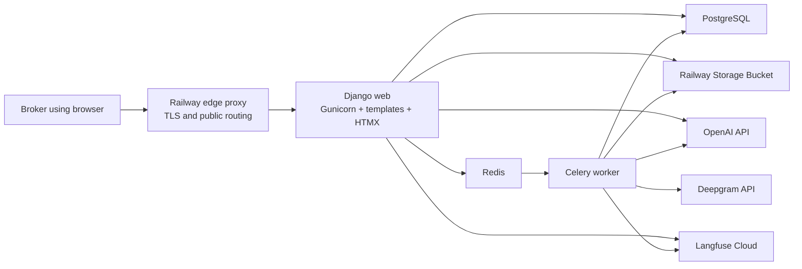
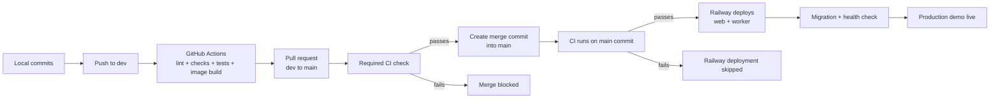

# Goodlane Freight Carrier Agent

## Step 1 — Architecture and Engineering Foundation

**Status:** Agreed; revised after design review  
**Version:** 1.1  
**Last updated:** August 20, 2026  
**Related documents:** [Product Requirements Document](../prd.md) · [Domain Model](./step-2-domain-model.md) · [Processing Pipeline](./step-3-pipeline.md) · [Production Deltas](../production-deltas.md)

---

## 1. Purpose

This document records the architecture and engineering-foundation decisions for the Goodlane Freight Carrier Agent take-home. It complements the PRD: the PRD defines what the product must do, while this specification defines the system shape, stack, deployment, configuration, delivery workflow, testing foundation, and operational safeguards.

Domain records and processing behavior are intentionally owned by the linked Step 2 and Step 3 specifications so this file remains the single source of truth only for Step 1.

---

## 2. Step 1 Decision Summary

The P0 system will use:

- A Django monolith for business logic, HTTP endpoints, authentication, and server-rendered pages.
- Django templates with HTMX for interactive UI behavior without a separate frontend application.
- Gunicorn as the production Django application server.
- PostgreSQL as the system of record.
- Redis as the Celery message broker and, only where useful, a short-lived cache.
- Celery workers for long-running ingestion and AI processing.
- OpenAI as the only LLM provider in P0 for structured extraction, reasoning, drafting, and tool-calling workflows. Additional providers (Gemini, Claude) are P2/P3 adapters behind the existing provider boundary, not P0 fallbacks.
- Deepgram for prerecorded WAV transcription.
- Python 3.12 and Django 5.2 LTS, with Pydantic v2 owning the AI structured-output boundary.
- Langfuse Cloud for prompt management, traces, token and cost tracking, latency visibility, and evaluations.
- Docker Compose for a reproducible local environment.
- Railway paid hosting for the deployed interview demo.
- A Railway private, S3-compatible Storage Bucket for shared and durable audio uploads.
- Test-driven development with deterministic application tests separated from probabilistic AI evaluations.
- Small, coherent, passing Git commits that can each be explained during the interview.
- GitHub Actions for continuous integration on pushes and pull requests.
- Railway GitHub autodeploys from `main`, gated by successful CI checks.
- A Makefile that provides the same development and verification commands locally and in CI.
- Structured JSON logging for completed web requests, background jobs, and outbound provider calls, queryable in Railway's log explorer.
- A fixed demo clock anchored by `DEMO_AS_OF_DATE` so dataset-relative behavior remains reproducible.

The P0 system will **not** include:

- Next.js, React, or another separate frontend application.
- Self-hosted Langfuse.
- Celery Beat unless a real recurring P0 requirement is discovered.
- A vector database unless evaluations demonstrate that structured retrieval is insufficient.
- Automatic carrier contact, booking, or phone integration.

---

## 3. Architectural Principles

### 3.1 One product, one codebase

The product is a Django monolith. Web requests, UI rendering, business rules, provider adapters, and background task definitions live in one repository and share one domain model.

Railway runs the same application image in different roles:

- The **web service** runs Gunicorn.
- The **worker service** runs Celery.

This avoids separate codebases and keeps the live-extension portion of the interview easier to navigate.

### 3.2 Deterministic logic before model judgment

Business rules such as insurance validity, date comparisons, best-rate selection, evidence linking, and record matching should be implemented deterministically wherever possible. The language model is used for language understanding and controlled tool selection, not as a replacement for ordinary application logic.

### 3.3 One ingestion pipeline

Preloaded dataset records and manually submitted records must enter the same core processing pipeline. The input mechanism may differ, but extraction, reconciliation, validation, evidence creation, status handling, metrics, and tracing must remain consistent.

### 3.4 Provider boundaries

OpenAI, Deepgram, Langfuse, and storage access will sit behind application-owned interfaces. Domain code must not depend directly on a provider SDK response shape.

This makes it possible to:

- Mock providers in deterministic tests.
- Change models through configuration.
- Retry provider failures safely.
- Preserve raw provider responses for debugging.
- Replace a provider without rewriting domain logic.

### 3.5 Observability must not control availability

Failures sending traces to Langfuse must not cause an otherwise successful ingestion or user request to fail. Product records remain in PostgreSQL; Langfuse is the detailed AI observability and evaluation system.

---

## 4. High-Level Architecture



### Component responsibilities

| Component | Primary responsibility |
|---|---|
| Django web | Authentication, pages, forms, HTMX endpoints, synchronous assistant and drafting requests, and enqueueing long-running jobs |
| Gunicorn | Production WSGI process serving Django |
| Celery worker | Audio transcription, extraction, reconciliation, validation, and other long-running jobs |
| PostgreSQL | Durable application records, job state, evidence, decisions, and executive metrics |
| Redis | Celery broker and optional short-lived cache; never the system of record |
| Railway Storage Bucket | Durable WAV files and other shared uploaded media |
| OpenAI | Structured extraction, assistant responses, drafts, and bounded function/tool calls |
| Deepgram | Prerecorded speech-to-text for WAV calls |
| Langfuse Cloud | Prompt versions, traces, observations, usage, cost, latency, scores, datasets, and evaluations |

---

## 5. Application Runtime

### 5.1 Django and HTMX

Django templates and HTMX are sufficient for this demo's dashboards, inbox updates, ingestion status polling, detail panels, forms, and partial page refreshes. This provides a responsive product demonstration without the cost of maintaining a separate frontend API and JavaScript application.

### 5.2 Synchronous and asynchronous boundaries

The web process will handle operations that should complete within a normal request:

- Authentication and navigation.
- Dashboard, inbox, load, carrier, and review queries.
- Deterministic filters and calculations.
- Enqueueing ingestion jobs.
- Interactive assistant and drafting operations with explicit provider timeouts and bounded tool-loop iterations.

Celery will handle long-running or retryable operations:

- WAV transcription.
- Email and transcript extraction.
- Batch dataset ingestion.
- Reconciliation and validation following extraction.
- Evaluation runs when initiated from a command or administrative action.

Celery is not the real-time UI mechanism. The UI will retrieve durable job status from PostgreSQL using HTMX polling. This prevents job progress from disappearing when a process restarts.

Interactive OpenAI requests run in the Django web service so the assistant and drafting experiences remain immediate. Their database records, provider metadata, and traces are still persisted. If an interactive operation cannot complete within its bounded request timeout, it must fail visibly rather than continue indefinitely. Deepgram calls and long-running OpenAI ingestion or evaluation calls run in Celery.

### 5.3 Celery Beat

Celery Beat is excluded from P0 because no agreed P0 behavior requires a recurring schedule. It may be added later for scheduled evaluations, cleanup, compliance refreshes, or simulations. For a small number of independent schedules, a Railway cron service may be simpler than operating Beat.

Because Beat is absent, the stuck-job sweep (section 13) is lazy rather than scheduled. Any job-status poll runs one bounded global query across all processing jobs older than the configured threshold; it is not limited to the job being viewed. The seed health summary invokes the same sweep before reporting status, so abandoned dataset jobs are visible even when their individual pages are never polled.

### 5.4 Toolchain

| Decision | Choice | Reason |
|---|---|---|
| Python | 3.12 | Current, matches the development machine, supported by every dependency |
| Django | 5.2 LTS | Long-term support and mature library ecosystem beat chasing 6.x for a demo that must be stable |
| Dependency manager | `uv` with a committed lockfile | Fast, reproducible installs locally, in CI, and in the Docker build |
| Tests | `pytest` + `pytest-django` | Standard, expressive, supports the layered strategy in section 10 |
| Lint and format | `ruff` (both roles) | One fast tool for `make lint` and `make format` |
| AI-boundary validation | Pydantic v2 | Generates the JSON Schema sent to OpenAI structured outputs and validates every model response before it can touch canonical records |
| HTTP and DB validation | Django forms and model constraints | No DRF; the UI is server-rendered, so there is no JSON API surface needing serializers |
| Auth model | Django's built-in `User` | One demo superuser created manually via `createsuperuser`, with the demo email as its username so the login form reads as email plus password; a custom user model is unnecessary for a single account and is recorded as a production delta |

The validation boundary rule: **Pydantic at the provider boundary, Django forms at the HTTP boundary, model constraints at the database boundary.** A model response that fails Pydantic validation is recorded as a failed extraction; it never reaches the ORM.

### 5.5 HTMX, CSRF, sessions, and polling

- `django-htmx` middleware is used; the base template carries the CSRF token via `hx-headers`, and every state-mutating HTMX endpoint is a POST.
- Sessions use Django's default database backend, so a Redis restart cannot log the broker out.
- Job-status polling runs every 2–3 seconds and stops on a terminal status (completed, needs review, or failed). Poll endpoints are logged at debug level so they do not flood the canonical request log.

---

## 6. AI and Speech Providers

### 6.1 OpenAI

The initial default model will be a smaller, cost-sensitive OpenAI model configured through environment variables. The current recommended baseline is `gpt-5.6-luna`, using `none` or `low` reasoning effort depending on the operation.

Planned use cases include:

- Structured extraction from emails and transcripts.
- Drafting broker-approved responses.
- Answering scoped operational questions.
- Selecting from explicitly allowed application tools.

Structured extraction will use a strict application-owned schema. Model output must be parsed and validated before it changes canonical records.

Model selection is evaluation-driven:

1. Establish the smaller model as the baseline.
2. Measure field accuracy, tool correctness, latency, and cost on representative examples.
3. Improve the prompt or deterministic context first when appropriate.
4. Upgrade only the failing operation to a stronger model if evaluations justify it.

The model name and reasoning effort must not be hardcoded into domain logic. Configuration supports this explicitly: `OPENAI_MODEL` and `OPENAI_REASONING_EFFORT` define the global baseline, and optional per-operation overrides (`OPENAI_MODEL_EXTRACTION`, `OPENAI_MODEL_ASSISTANT`, `OPENAI_MODEL_DRAFTING`, each with an optional effort counterpart) allow upgrading a single failing operation without touching the others.

OpenAI is the only LLM provider in P0. A Gemini or Claude adapter is a P2/P3 extension that plugs into the provider boundary (section 3.4); it is deliberately not a P0 fallback, because a fallback path that only executes during a provider outage is a path that is never rehearsed.

### 6.2 Deepgram

Deepgram will process the supplied and manually uploaded WAV calls using its prerecorded transcription API. The current baseline is the Nova-3 model with readable formatting, utterance segmentation, and speaker diarization where supported.

The application will preserve:

- The source audio identifier.
- The raw provider response needed for debugging.
- The normalized transcript.
- Speaker and timing information when available.
- Provider/model metadata and processing timestamps.

The baseline request options are `model=nova-3`, `smart_format=true`, `utterances=true`, and `diarize_model=latest`. Deepgram has deprecated the older `diarize=true` parameter for prerecorded transcription in favor of `diarize_model`; older tutorials showing `diarize=true` must not be followed. The resolved diarization model version is preserved in the provider metadata of every transcript so evaluation runs remain reproducible.

### 6.3 Langfuse Cloud

Langfuse Cloud replaces the earlier self-hosted Langfuse proposal. Both Django and Celery will emit traces using the same Langfuse project, using the Langfuse Python SDK pinned to the v4 major version (`langfuse>=4,<5`; v3 examples online use `LANGFUSE_HOST` and different client initialization and must not be followed).

Access to Langfuse Cloud uses social login (Google or GitHub), so no Langfuse password exists to share or reuse. The Goodlane reviewer is invited to the organization with the read-only **Viewer** role; the free Hobby plan allows two users total, so one reviewer is invited directly and any additional reviewers see Langfuse through screen share. The invitee must sign in with the exact email address the invitation was sent to.

Langfuse will contain detailed AI information:

- Prompt names and versions.
- Inputs and outputs.
- Model and provider metadata.
- Tool calls and results.
- Latency, tokens, and cost.
- Evaluation datasets, runs, and scores.
- Failure analysis and prompt improvement notes.

#### Prompt runtime and fallback behavior

Langfuse Prompt Management is the source of truth for prompt versions, labels, evaluation, and normal runtime delivery. The repository will contain executable bundled fallback prompts such as:

```text
prompts/
├── extraction/
│   └── carrier_inquiry.yaml
├── assistant/
│   └── operations_assistant.yaml
└── drafting/
    └── carrier_response.yaml
```

These files are deployable availability artifacts, not a second prompt-documentation system. Each fallback contains only the prompt name, type, template, required variables, and optional synchronization metadata such as the approved Langfuse version or template checksum. It matches the latest reviewed prompt, which may briefly lead the Langfuse `production` label during a release (between merge-deploy and promotion, a fresh process falling back to the bundled file serves the reviewed-but-not-yet-promoted version; this window is accepted for a single-author project). The file must not be edited independently of the release workflow below.

The runtime fallback order is:

1. Fetch the prompt carrying the Langfuse `production` label.
2. If Langfuse is unavailable, use the Langfuse SDK's cached last-known-good prompt.
3. If a fresh process has no usable cached prompt, use the bundled local fallback supplied to the SDK.
4. If the local fallback is missing or invalid, fail the AI operation in a controlled way without calling OpenAI with an empty or malformed prompt.

The application records the selected prompt source when known (`langfuse`, `cache`, or `local_fallback`) together with the prompt version or template hash. A local-fallback event is also surfaced in structured logs so it is visible operationally.

The prompt release workflow is:

1. Change the bundled fallback prompt in the repository and review it through the normal pull request process.
2. Validate that it exists, compiles, and declares all required variables locally and in CI.
3. Publish that reviewed prompt to Langfuse as a new immutable version with a `candidate` label.
4. Run the representative offline evaluation against that candidate version.
5. Promote the successful version to the Langfuse `production` label.
6. Record the approved Langfuse version or checksum with the bundled fallback so reviewers can verify that the deployed fallback remains synchronized.
7. Fetch the `production` prompt at runtime and attach the exact Langfuse prompt version or local template hash to its trace.

Prompt text and prompt variables are managed through this workflow. Extraction JSON schemas, allowed tool definitions, authorization boundaries, and deterministic validation rules remain typed application code and cannot be changed by editing a prompt.

#### Trace visibility timing

The Langfuse SDK buffers events in memory and sends them in asynchronous batches, so a trace can lag the work it describes. Two rules absorb that lag:

- Every Celery task and interactive AI request calls `flush()` before marking its job or run complete, so completion in the product implies the trace has been handed to Langfuse.
- The UI shows a "View trace in Langfuse" link only after the job reaches a terminal state, never while processing. If a specific trace link is unavailable, the UI falls back to linking the Langfuse project dashboard and the presenter navigates to the trace manually.

The Goodlane UI will display only the executive-level operational metrics required by the PRD. The interview walkthrough can open Langfuse Cloud to demonstrate detailed traces and evaluations.

---

## 7. File and Media Storage

### 7.1 Why shared storage is required

A WAV uploaded to the Django web service must later be readable by the Celery worker. Railway services do not share a local filesystem, and container-local files are not durable deployment storage.

### 7.2 Production storage

A private Railway Storage Bucket will store all audio: the 55 dataset WAVs (copied into the bucket by the seed command from the committed dataset, skipping any object whose checksum already matches) and manual uploads. It is S3-compatible and can be accessed by both the web and worker services using Railway-provided credentials.

The storage stack is `django-storages` with the S3 backend and `boto3` in production, and Django `FileSystemStorage` on the shared media volume locally. Application code deals with storage keys through Django's storage API in both environments, so no code path differs between them.

One clarification for section 8.2's networking statement: Railway Buckets are reached over their public S3 endpoint with credentials (Railway does not yet offer private-network bucket access). The bucket itself remains access-private; only its transport is public.

### 7.3 Local storage

Local Docker Compose may use a shared named media volume mounted into both web and worker containers. Provider-facing and domain code must use the same storage abstraction in both environments.

### 7.4 Access policy

Audio is private. The product exposes it exclusively through an authenticated Django streaming endpoint — the same code path locally and in production, with no signed-URL expiry to break playback mid-review. Public bucket access is not required.

---

## 8. Container and Deployment Design

### 8.1 Local Docker Compose

The local environment will contain:

| Service | Source | Purpose |
|---|---|---|
| `web` | Project Dockerfile | Django development/production-like web process |
| `worker` | Same project image | Celery worker |
| `postgres` | Official PostgreSQL image pinned to the production major version | Local durable database |
| `redis` | Official Redis image pinned to the production major version | Local Celery broker |

The web and worker will use the same built image but different commands. Health checks and dependency readiness will be configured so application processes do not assume that a started database container is already ready to accept connections.

The local Compose environment will not self-host Langfuse.

After Railway provisions PostgreSQL and Redis, their production major versions will be recorded. Docker Compose and GitHub Actions will pin matching major versions so local and CI behavior do not drift from production. The blueprint does not assume a Railway database version before provisioning confirms it.

### 8.2 Railway project

Railway will contain:

```text
Railway Project
├── Django Web             same application image
├── Celery Worker          same application image, different command
├── PostgreSQL             Railway database service
├── Redis                  Railway database service
└── Storage Bucket         private S3-compatible media storage

External Services
├── OpenAI API
├── Deepgram API
└── Langfuse Cloud
```

Only the Django web service receives a public domain. Worker, Redis, and PostgreSQL remain on private networking.

Railway translates the local multi-service design into separate Railway services; it does not run the production application as one Docker Compose process.

### 8.3 Commands

The expected service commands are:

```text
Django web:
gunicorn config.wsgi:application --worker-class gthread --workers 2 --threads 4 --timeout 120

Celery worker:
celery -A config worker -l info --concurrency=2
```

The Gunicorn worker class is a design decision, not a tuning value, because interactive assistant and drafting requests hold a web request open for a multi-iteration OpenAI tool loop. With default synchronous workers, one assistant question would occupy an entire worker for its full duration while HTMX status polling starves. `gthread` threads release the GIL while blocked on provider I/O, so polling and page loads continue during an in-flight AI call; 2 workers x 4 threads serves 8 concurrent requests.

One property of `gthread` must be understood correctly: under this worker class, `--timeout` is a worker **liveness heartbeat**, not a per-request killer — the worker's main thread keeps notifying the arbiter while request threads are busy, so a long request is *not* terminated at the timeout. That is desirable (no mid-demo 502 from Gunicorn), but it also means there is **no server-side backstop** for a runaway request: the only real guards are the application-enforced assistant budget (`ASSISTANT_TIMEOUT_SECONDS`, checked between tool iterations) and **mandatory per-provider-call socket timeouts** on every OpenAI, Deepgram, storage, and Langfuse call. Both are therefore required, not optional. `--timeout 120` is retained as the liveness setting. Thread and worker counts may still be tuned after observing the deployed allocation; the class and the application-level budgets may not.

The Celery worker concurrency is intentionally conservative for the demo and can be adjusted after observing memory, API rate limits, and ingestion duration.

### 8.4 Release lifecycle

- The Docker build installs dependencies and collects static assets.
- Railway runs `python manage.py migrate` as a pre-deploy command for the web service only.
- Dataset loading is a separate idempotent management command, not an unconditional action on every process start.
- Production seeding is an explicit one-off command executed inside the deployed web container after the first healthy deployment, for example `railway ssh --service web -- python manage.py seed`. The command imports the reference data from the committed dataset, copies the dataset WAVs into the Storage Bucket (skipping objects whose checksums already match), and enqueues required transcription and extraction work. Re-running seed safely recovers missing imports, missing storage objects, and eligible queued work; it deliberately does not retry terminal failed jobs because doing so could repeat paid provider calls.
- Bulk recovery of terminal failures uses the separate `retry_failed_jobs` management command defined in the Step 3 pipeline specification. It previews a filtered snapshot/source/error-code selection and requires explicit confirmation before reusing and redispatching those jobs.
- Seeding may make approximately 55 Deepgram calls and 329 OpenAI extraction calls when every supplied call and email is processed live. This one-time cost must be documented accurately. Accepted caveat: wiping the database and reseeding re-runs the extractions, whose outputs may differ slightly between runs; record counts and identities are stable, extracted field values may vary.
- The demo login is created once, manually, inside the deployed container, with the `DEMO_USER_*` variables as the single source of truth for the credentials: `createsuperuser --noinput` reads them through Django's standard mapping (`DJANGO_SUPERUSER_USERNAME=$DEMO_USER_EMAIL DJANGO_SUPERUSER_EMAIL=$DEMO_USER_EMAIL DJANGO_SUPERUSER_PASSWORD=$DEMO_USER_PASSWORD python manage.py createsuperuser --noinput`). The demo email is the username, so the login form reads as email plus password. No idempotent wrapper is built; a second run of the command simply errors, which is acceptable for a single-account demo. The same credentials are documented for the Goodlane team.
- The web service exposes `/healthz`, which verifies database connectivity only (no Redis or provider checks), and listens on Railway's injected port.
- Railway activates a new web deployment only after the health endpoint returns success.
- Web and worker services use an appropriate restart-on-failure policy.

### 8.5 Static files and public routing

Railway supplies the external edge proxy, TLS termination, domains, and HTTP routing. Gunicorn serves Django, and WhiteNoise serves fingerprinted and compressed static assets.

---

## 9. Configuration and Secrets

Local secrets will be stored in an ignored `.env` file. Railway secrets will be stored as service variables. A committed `.env.example` will list required keys without values.

Expected configuration groups include:

```text
Django
DJANGO_SECRET_KEY
DJANGO_DEBUG
DJANGO_ALLOWED_HOSTS
DJANGO_CSRF_TRUSTED_ORIGINS
DEMO_USER_EMAIL
DEMO_USER_PASSWORD
DEMO_AS_OF_DATE
APP_TIME_ZONE

Data and queue
DATABASE_URL
REDIS_URL

OpenAI
OPENAI_API_KEY
OPENAI_MODEL
OPENAI_REASONING_EFFORT
OPENAI_MODEL_EXTRACTION        optional per-operation override
OPENAI_MODEL_ASSISTANT         optional per-operation override
OPENAI_MODEL_DRAFTING          optional per-operation override
OPENAI_REASONING_EFFORT_EXTRACTION   optional per-operation effort override
OPENAI_REASONING_EFFORT_ASSISTANT    optional per-operation effort override
OPENAI_REASONING_EFFORT_DRAFTING     optional per-operation effort override

Assistant bounds
ASSISTANT_MAX_TOOL_ITERATIONS  default 6
ASSISTANT_TIMEOUT_SECONDS      default 45; must stay below the Gunicorn timeout

Uploads
AUDIO_MAX_UPLOAD_BYTES         default 26214400 (25 MB)
AUDIO_MAX_DURATION_SECONDS     default 600
                               accepted format: PCM WAV; other sample rates and
                               stereo are accepted (Deepgram handles them)

Deepgram
DEEPGRAM_API_KEY
DEEPGRAM_MODEL

Langfuse Cloud
LANGFUSE_PUBLIC_KEY
LANGFUSE_SECRET_KEY
LANGFUSE_BASE_URL
LANGFUSE_PROMPT_LABEL
LANGFUSE_CAPTURE_PAYLOADS      default true for the demo; controls whether prompt
                               inputs/outputs are captured in traces (PRD 12.4)

Object storage
AWS_ACCESS_KEY_ID
AWS_SECRET_ACCESS_KEY
AWS_STORAGE_BUCKET_NAME
AWS_S3_ENDPOINT_URL
AWS_S3_REGION_NAME
```

Rules:

- Secrets must never be committed, printed in logs, embedded in images, or stored in trace metadata.
- Both web and worker receive only the variables required for their roles.
- Production hosts and CSRF origins are explicit rather than wildcarded.
- Provider keys are server-side only.

### 9.1 Values the candidate must create or provide

The following values require an account decision or credential from the candidate:

| Variable | Where it comes from | Required for P0 | Notes |
|---|---|---:|---|
| `OPENAI_API_KEY` | OpenAI project | Yes | Create a project-scoped key with an appropriate usage budget |
| `DEEPGRAM_API_KEY` | Deepgram project | Yes | Create a project-scoped key for prerecorded transcription |
| `LANGFUSE_PUBLIC_KEY` | Langfuse Cloud project | Yes | Available in the Langfuse project settings |
| `LANGFUSE_SECRET_KEY` | Langfuse Cloud project | Yes | Must be treated as a secret |
| `LANGFUSE_BASE_URL` | Selected Langfuse Cloud region | Yes | Copy the base URL shown for the chosen Langfuse project/region |
| `DEMO_USER_EMAIL` | Candidate-selected demo login | Yes | Email used to sign into the deployed demo (also used as the Django username) |
| `DEMO_USER_PASSWORD` | Candidate-selected demo login | Yes | Use a unique generated password, not a reused personal password. Langfuse Cloud is accessed via social login, so no Langfuse password exists to overlap with this one |
| `DJANGO_SECRET_KEY` | Generated once by the candidate | Yes | `python -c "from django.core.management.utils import get_random_secret_key; print(get_random_secret_key())"`, then set as a Railway variable |

These values should be entered directly into Railway variables and into the ignored local `.env` file. They should never be pasted into source files, committed documentation, pull requests, screenshots, or chat transcripts.

The candidate does **not** need to create or provide:

- `DATABASE_URL`; Railway PostgreSQL supplies it.
- `REDIS_URL`; Railway Redis supplies it.
- Bucket access keys, endpoint, region, or name; Railway Storage Bucket supplies them.
- A Railway API token; Railway's GitHub integration performs the agreed deployment flow.
- A GitHub personal access token; GitHub Actions receives its standard repository token automatically.

### 9.2 Non-secret application configuration

The repository will provide safe defaults where possible and document environment-specific values for:

- `OPENAI_MODEL` and reasoning effort.
- `DEEPGRAM_MODEL` and transcription options.
- `LANGFUSE_PROMPT_LABEL`, using `production` in the deployed environment and `candidate` only during explicit evaluation.
- `DEMO_AS_OF_DATE`, with the P0 dataset anchored to `2026-05-25`.
- `APP_TIME_ZONE`, defaulting to `America/New_York` for broker-facing dates and times.
- Allowed hosts and trusted CSRF origins.
- Storage backend selection.
- Celery queue, retry, and timeout settings.
- Logging level and environment name.

The committed `.env.example` will distinguish required values, generated values, Railway references, and optional settings.

The fixed clock has specific semantics:

- Relative expressions such as “today,” “tomorrow,” and “this week” are resolved against `DEMO_AS_OF_DATE`, not the machine's real clock.
- Insurance eligibility for a load is evaluated against that load's pickup date.
- Market-rate selection uses the latest applicable rate record on or before the relevant load or pickup date.
- Timestamps are stored in UTC and rendered in `APP_TIME_ZONE` unless the source explicitly requires another interpretation.
- Manual submissions coerce the **business** timestamp, never the **audit** timestamp: the ingestion service derives `occurred_at` from the active snapshot's stored `as_of_at` local date (initially resolved from `DEMO_AS_OF_DATE`) plus the submission's real local time of day, while `received_at` keeps the true instant untouched. Business time is normalized to the persisted demo clock; audit time is real; both are stored.
- A persistent header badge shows “Demo clock: May 25, 2026,” and broker-facing views prefer absolute dates over relative “ago” phrasing.

---

## 10. Testing Strategy

### 10.1 TDD cycle

Each behavior will use the following working cycle:

1. State the expected behavior and edge cases.
2. Write a failing test.
3. Implement the smallest correct behavior.
4. Refactor while keeping the tests green.
5. Run the relevant focused suite and then the broader suite.
6. Commit the tested behavior as one coherent checkpoint.

Failing red-phase tests do not need to be committed to the main branch. The resulting commit should include both the test and its implementation and leave the repository runnable.

### 10.2 Test layers

| Layer | Examples |
|---|---|
| Pure unit tests | Date rules, compliance logic, rate selection, evidence status, normalization, and matching decisions |
| Database integration tests | Idempotent imports, record reconciliation, evidence persistence, and job transitions |
| Provider contract tests | OpenAI, Deepgram, Langfuse, and storage adapters using controlled fixtures/mocks |
| Task tests | Celery orchestration, retries, idempotency, and failure persistence |
| HTTP/UI tests | Authentication, page access, forms, HTMX fragments, and review actions |
| Smoke tests | Critical deployed user journey and health endpoint |
| Offline AI evaluations | Extraction/tool quality on the hand-labeled representative dataset |

### 10.3 Deterministic tests versus evaluations

Normal tests must not depend on live OpenAI or Deepgram responses. Network calls will be mocked or replaced with saved, reviewed fixtures.

Live-provider checks and offline AI evaluations are separate, explicitly invoked workflows. Their output measures quality, latency, and cost but does not replace deterministic application tests.

The goal is meaningful behavior coverage, not an arbitrary coverage percentage.

---

## 11. Git and Commit Discipline

### 11.1 Commit requirements

Every implementation commit should:

- Represent one coherent capability or architectural decision.
- Include the associated tests.
- Leave relevant tests passing.
- Avoid unrelated formatting or refactoring.
- Contain no credentials, personal or third-party confidential data, or generated runtime files. The provided Goodlane dataset is the explicit exception: it is committed under `goodlane-dataset/` because the in-container seed command reads it from the image. The repository remains private and is shared only with the Goodlane team; if it is ever made public, the dataset must first be removed with a history rewrite, since git history retains deleted files.
- Explain the reason and tradeoff, not only the changed filenames.

### 11.2 Commit message structure

Commit titles will use a consistent form such as:

```text
feat(ingestion): import carrier emails idempotently
test(compliance): cover insurance validity at pickup time
chore(deploy): add Railway web health check
docs(architecture): record storage and worker boundaries
```

When useful, the commit body will answer:

```text
Why:
What:
Tradeoff:
Tests:
```

### 11.3 Interview walkthrough

A `docs/commit-walkthrough.md` file will be maintained during implementation. For each meaningful commit it will summarize:

- The user or system problem addressed.
- The technical decision.
- Why that decision was chosen.
- Important alternatives or tradeoffs.
- Tests proving the behavior.
- What the next commit builds on top of it.

Before creating a commit, its intended scope and message should be clear. After creating it, its behavior and test evidence should be explainable without relying on a large mixed diff.

---

## 12. CI/CD and Developer Commands

### 12.1 Delivery flow

GitHub Actions provides continuous integration. Railway's GitHub integration provides continuous deployment.



The workflow will run on:

- Every push to `dev`.
- Every pull request from `dev` into `main`.
- Every push to `main`, which is required for Railway's Wait for CI behavior.

The `main` branch should be protected against direct pushes and require the CI status check before merging. This makes the `dev` to `main` pull request the normal path into production.

### 12.2 Branching and merge policy

The repository will use two persistent branches:

| Branch | Purpose | Deployment behavior |
|---|---|---|
| `dev` | Integration branch for the implementation commits currently being developed and reviewed | Runs CI but does not deploy production |
| `main` | Stable, interview-ready production history | Runs CI and deploys to Railway only after CI succeeds |

The normal working process is:

1. Create small, understandable commits locally.
2. Push those commits to `dev` regularly.
3. Fix any CI failure on `dev` before opening or merging the release pull request.
4. Open a pull request from `dev` to `main`.
5. Require the pull request's CI checks to pass.
6. Use **Create a merge commit** so the exact implementation commit hashes remain visible and the release has an explicit pull-request boundary.
7. Do not squash the pull request because a squash would remove the commit-by-commit implementation story required for the interview.
8. After the pull request merges, fast-forward `dev` to the new `main` merge commit before continuing work.

Railway must watch only `main`. A push to `dev` must never trigger a production deployment. A separate Railway staging environment for `dev` is optional and excluded from P0.

### 12.3 CI checks

The initial CI workflow will perform these actions in order:

1. Check out the exact commit.
2. Install the pinned Python dependencies.
3. Run formatting and lint checks.
4. Run Django system checks.
5. Verify that model changes do not have missing migrations.
6. Validate bundled fallback prompts and required variables without calling Langfuse.
7. Run deterministic unit and integration tests against PostgreSQL and Redis test services.
8. Verify that the production Docker image builds successfully.

Normal CI will not call OpenAI, Deepgram, or Langfuse. Provider behavior is exercised using mocks and reviewed fixtures. Live API smoke tests and offline evaluations remain manually invoked or explicitly approved workflows so routine pushes do not incur cost or become nondeterministic.

### 12.4 Continuous deployment

Both the Django web service and Celery worker service will connect to the same GitHub repository and track the `main` branch.

Railway's **Wait for CI** option must be enabled on both services:

- A new `main` commit enters Railway's waiting state while GitHub Actions runs.
- If any required workflow fails, Railway skips that deployment.
- If all workflows pass, Railway builds and deploys the new web and worker images.
- The Django web service runs database migrations as its pre-deploy command.
- Railway activates the new web deployment after `/healthz` returns HTTP 200.

Deployment is intentionally handled by Railway's GitHub integration rather than by storing a Railway token in GitHub Actions.

### 12.5 Makefile interface

Developers and CI will call the same Make targets. The underlying commands may evolve, but these public targets should remain stable:

| Target | Purpose |
|---|---|
| `make setup` | Create the local configuration and install or build project dependencies |
| `make up` | Start the local Docker Compose services |
| `make down` | Stop local services without deleting durable volumes |
| `make logs` | Follow application and worker logs |
| `make migrate` | Apply Django migrations |
| `make seed` | Run the idempotent Goodlane dataset import |
| `make lint` | Run formatting and static lint checks |
| `make format` | Apply approved automatic formatting locally |
| `make check` | Run Django checks and verify that migrations are current |
| `make test` | Run the deterministic test suite |
| `make test-unit` | Run the fast unit-test subset |
| `make test-integration` | Run database, task, and adapter integration tests |
| `make build` | Build the production application image |
| `make ci` | Run the complete non-mutating CI verification sequence |
| `make eval` | Run the explicitly requested offline evaluation workflow |
| `make prompts-check` | Validate bundled fallback prompts without network calls |
| `make prompts-publish` | Explicitly publish a reviewed bundled prompt as a new Langfuse candidate version |

`make ci` must be safe to run repeatedly and must not modify tracked files, call paid AI APIs, seed production data, or require developer-specific global tools beyond Docker and Make.

### 12.6 Failure and rollback behavior

- Lint, check, test, or image-build failure blocks pull-request merging.
- A failure on the `main` check causes Railway to skip deployment.
- A failed migration prevents the new web release from becoming active.
- A failed health check prevents Railway from routing traffic to the new web release.
- Railway retains prior deployments so the last known-good image can be redeployed or rolled back.
- Database migrations should be backward-compatible with the currently running web and worker versions whenever practical.

---

## 13. Operational Safeguards

- Ingestion jobs must be idempotent so retries do not create duplicate inquiries.
- Provider operations must use explicit timeouts and bounded retries.
- A provider failure must produce a durable failed or needs-review state rather than silently losing work.
- Ingestion tasks set Celery `task_time_limit`/`soft_time_limit`; expiry transitions the job to failed with a safe error summary, so no watched upload can hang silently.
- A lazy stale-job sweep runs inside the job-status endpoint as a bounded global update: any processing job older than the configured threshold is moved to failed when any job is polled, regardless of which job is being viewed. The same sweep also fails immediate-dispatch (manual-origin) jobs still queued beyond the threshold with `queue_unavailable`, closing the crash window where a process dies after commit but before its dispatch callback publishes the task. Dataset-origin queued jobs are deliberately excluded: under deferred dispatch they legitimately wait for the bulk dispatcher, and rerunning seed recovers them. Seed health reporting invokes the same service before aggregating status. Failed jobs render an individual retry control, while filtered bulk recovery requires the explicit management command. No scheduler is needed in P0.
- Errors use a single application-owned category enum (for example provider_timeout, provider_rate_limit, validation_failed, extraction_schema_invalid, storage_error, internal) shared by logs and models; the full vocabulary is enumerated in Step 3.
- Celery task arguments should contain stable record or storage identifiers, not large email bodies or audio bytes.
- Redis loss must not delete canonical product state.
- Raw evidence must retain stable email IDs and call IDs.
- The Celery result backend is disabled; durable application job and task state lives in PostgreSQL rather than Redis.
- Langfuse traces must not contain secrets.
- The broker remains the final decision-maker; the system does not automatically contact or book a carrier.

### 13.1 Structured logging and Railway observability

Observability uses three complementary layers with deliberate correlation between them:

| Event | Emitted once per | Answers | Lives in |
|---|---|---|---|
| Canonical log line | Completed web request or background task | What happened, outcome, duration, provider-call totals, and relevant cost totals | Railway logs |
| Provider-call event | Outbound OpenAI, Deepgram, or object-storage call | Which dependency call failed, retried, or was slow | Railway logs |
| Langfuse trace | AI operation | Prompt version, model input/output, token details, tool calls, and evaluation scores | Langfuse Cloud |

The application emits one single-line structured JSON event for each completed web request and background task. It includes the environment, request or task identifier, route or task name, authenticated user identifier when present, relevant ingestion/load/carrier identifiers, outcome, duration, provider-call counts, token and estimated-cost totals when applicable, Langfuse trace identifier, and a safe error category.

Each outbound provider call additionally emits a structured event from the provider-adapter boundary. It includes provider, operation, model where applicable, attempt number, outcome, duration, error category, and its parent request or task identifier. It never includes a prompt, email body, transcript, credential, or provider response payload.

Rules:

- Web middleware creates a correlation identifier. When the request enqueues background work, the identifier is propagated to the durable job and Celery task.
- Provider-call events and Langfuse traces carry the applicable correlation or trace identifiers.
- JSON events are written to stdout as a single line so Railway can parse and filter their attributes.
- Some high-level fields such as duration and estimated cost intentionally appear in both the application summary and Langfuse; detailed AI payloads remain only in Langfuse.
- Logging and trace-export failures must never change the business outcome of an otherwise successful operation.

---

## 14. Step 1 Acceptance Criteria

Step 1 is considered agreed when the team accepts that:

- Django, templates, and HTMX form the application UI and server architecture.
- Gunicorn serves Django in production behind Railway's edge proxy.
- PostgreSQL is the system of record.
- Redis and Celery handle background ingestion, transcription, extraction, batch, and evaluation processing; interactive assistant and drafting requests remain bounded Django web operations.
- Celery Beat is absent until a recurring requirement exists.
- OpenAI and Deepgram are external configurable providers.
- Langfuse Cloud provides runtime prompt management, traces, and evaluations, while bundled repository prompts provide code-reviewed third-level fallback coverage.
- Docker Compose provides the local environment.
- Railway hosts separate web and worker services from the same image.
- A Railway Storage Bucket makes uploaded WAV files durable and available to the worker.
- Tests and offline AI evaluations remain separate but complementary quality systems.
- Git history is intentionally organized for an interview walkthrough.
- GitHub Actions runs linting, checks, tests, and an image-build verification on pushes and pull requests.
- The `dev` branch is the integration branch and never deploys production.
- The protected `main` branch requires CI success before merge.
- Pull requests create a merge commit rather than rebasing or squashing, preserving exact implementation commit hashes and the release boundary.
- Railway waits for CI success before automatically deploying a `main` commit.
- Local development and CI use the same documented Make targets.
- Bundled fallback prompts are validated in CI; prompt publication and production promotion remain explicit operations.
- `DEMO_AS_OF_DATE` anchors relative dataset time while compliance and rate rules use their relevant business dates.
- Canonical JSON logs and provider-call events make web, worker, and dependency behavior queryable in Railway.
- Credential ownership is documented so candidate-provided, generated, and Railway-provided variables are not confused.

---

---

## 15. Current Technical References

- [OpenAI model guidance](https://developers.openai.com/api/docs/guides/latest-model)
- [Deepgram speaker diarization](https://developers.deepgram.com/docs/diarization/)
- [Langfuse Cloud and self-hosting overview](https://langfuse.com/self-hosting)
- [Langfuse Python SDK configuration](https://langfuse.com/docs/observability/sdk/overview)
- [Langfuse prompt versioning and labels](https://langfuse.com/docs/prompt-management/data-model)
- [Langfuse prompt caching and fallbacks](https://langfuse.com/docs/prompt-management/features/caching)
- [Railway public networking](https://docs.railway.com/networking/public-networking)
- [Railway Django deployment](https://docs.railway.com/guides/django)
- [Railway Docker Compose mapping](https://docs.railway.com/guides/docker-compose)
- [Railway deployment health checks](https://docs.railway.com/deployments/healthchecks)
- [Railway pre-deploy commands](https://docs.railway.com/deployments/pre-deploy-command)
- [Railway Storage Buckets](https://docs.railway.com/storage-buckets)
- [Railway structured logs](https://docs.railway.com/observability/logs)
- [Railway remote commands with SSH](https://docs.railway.com/cli/ssh)
- [Railway GitHub autodeploys and Wait for CI](https://docs.railway.com/deployments/github-autodeploys)
- [GitHub required status checks](https://docs.github.com/en/pull-requests/reference/status-checks)
