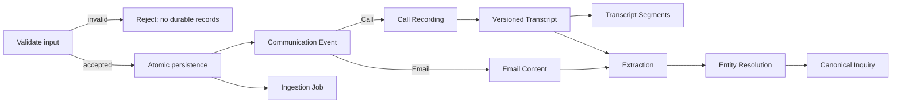
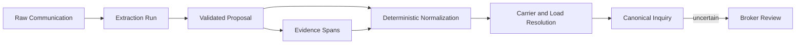

# Goodlane Freight Carrier Agent

## Step 2 — Domain Model and Database Schema

**Status:** Agreed; updated with Step 3 boundary decisions  
**Version:** 1.1  
**Last updated:** August 20, 2026  
**Related documents:** [Product Requirements Document](../prd.md) · [Architecture Foundation](./step-1-foundation.md) · [Processing Pipeline](./step-3-pipeline.md) · [Production Deltas](../production-deltas.md)

---

## 1. Scope

Step 2 defines the durable business records and the boundary between raw evidence, AI proposals, deterministic application decisions, and broker review. **Steps 2A through 2E plus the metrics and evaluation models in 2F form the P0 schema scope. The simulation models in 2F are P1**, matching the PRD's prioritization: the P0 live demonstration is the Manual Ingestion Lab (upload → pipeline → inquiry card), which needs nothing beyond 2A–2E; the scripted event-replay simulation is designed here but built only after the MVP acceptance criteria are green. Step 3 will translate these model decisions into ETL orchestration and service boundaries before implementation migrations are created.

## 2. Shared Database Conventions

Unless a model section states otherwise:

- Business records use internal UUID primary keys. External load IDs, email IDs, filenames, MC numbers, and DOT numbers are identifiers or evidence, not database primary keys.
- Imported records retain a stable external source identifier and their owning dataset snapshot.
- Mutable business records include timezone-aware `created_at` and `updated_at` timestamps; append-only records include `created_at`.
- Money and rates use PostgreSQL numeric values through Django `DecimalField`, never binary floating point.
- `NULL` means unknown. Missing rates, weights, dates, compliance facts, and identifiers must never be silently converted to zero, `False`, or an empty string.
- Controlled statuses use Django `TextChoices` with database check constraints where practical.
- Frequently filtered canonical values use typed columns and relationships. JSON is reserved for raw provider payloads, immutable value snapshots, flexible audit metadata, and validation errors.
- Important reference relationships use `PROTECT`. `CASCADE` is limited to owned details whose lifecycle cannot outlive their parent, such as transcript segments.
- Raw evidence and prior machine outputs are append-only. Corrections change canonical records or add review actions without rewriting the source.
- Normalized identifier columns are indexed independently of the raw display values.

## 3. Step 2A — Dataset, reference, load, carrier, and market models

### `DatasetSnapshot`

`DatasetSnapshot` represents the complete historical dataset and the business clock under which it is demonstrated.

| Field | Purpose |
|---|---|
| `id` | Internal UUID |
| `name` | Human-readable snapshot name |
| `version` | Dataset or import version |
| `as_of_at` | Resolved demo timestamp used for relative-time behavior |
| `display_timezone` | IANA timezone; P0 default is `America/New_York` |
| `manifest_checksum` | Checksum for the snapshot manifest |
| `is_active` | Identifies the P0 snapshot currently presented in the application |
| `imported_at` | Real system timestamp of completed import |

Only one snapshot may be active in P0, enforced by a conditional unique constraint. Snapshot `version` plus `manifest_checksum` is unique and identifies a resumable logical import. The import resolves `DEMO_AS_OF_DATE` into `as_of_at`; later application behavior reads the stored snapshot value. A completed snapshot is treated as immutable.

### `ImportBatch`

`ImportBatch` records one logical source import and makes seeding observable and repeatable. Four P0 batches correspond to individual files; the call-recording directory is one logical batch containing its 55 WAV records.

| Field | Purpose |
|---|---|
| `dataset_snapshot` | Owning snapshot |
| `source_type` | Loads, carriers, emails, calls, or market-rate history |
| `source_filename` | Reviewable source name |
| `content_checksum` | Idempotency and change-detection value |
| `status` | Queued, processing, completed, partially_failed, or failed |
| `records_seen` | Source record count |
| `records_created` | Newly inserted count |
| `records_existing` | Previously imported unchanged records encountered during a rerun |
| `records_failed` | Failed record count |
| `started_at`, `completed_at` | Execution timestamps |
| `error_summary` | Safe import failure description |

The snapshot, source type, source name, and checksum form the idempotency boundary. Re-running an unchanged import must not duplicate or update immutable snapshot records: a row is counted as created, existing, or failed. `partially_failed` means one or more structurally invalid records were rejected while other records imported; it is never used for intentional business uncertainty such as a missing MC number or conflicting email annotation. Every required P0 batch must be `completed` before snapshot activation, so `partially_failed` and `failed` both block activation until the same-manifest import succeeds on rerun or corrected source bytes are introduced as a new snapshot version.

### `EquipmentType` and `EquipmentAlias`

`EquipmentType` holds the canonical equipment vocabulary with a unique `code`, `display_name`, and `is_active` flag. Initial values are Box Truck, Sprinter Van, Flatbed, and Refrigerated.

`EquipmentAlias` maps a source-scoped `raw_label` and normalized form to one canonical equipment type. It allows deterministic normalization of variations without changing the source evidence. An unrecognized or conflicting label remains unresolved rather than being forced into a category.

### `Lane`

`Lane` contains `origin_state` and `destination_state`, with a unique constraint on the ordered pair. Lanes are directional: PA to NJ and NJ to PA are different records. Intra-state lanes such as PA to PA and NJ to NJ are valid and must not be rejected merely because both states match. City and ZIP details remain on `Load`; a generic location hierarchy is unnecessary for P0.

### `Load`

| Field group | Fields |
|---|---|
| Ownership | `dataset_snapshot`, `import_batch`, `external_load_id` |
| State | `status` |
| Origin | `origin_city`, `origin_state`, `origin_zip` |
| Destination | `destination_city`, `destination_state`, `destination_zip` |
| Routing | `lane`, `distance_miles` |
| Freight | `equipment_type`, `equipment_type_raw`, `weight_lbs` |
| Pickup | `pickup_date`, `pickup_window_raw`, `pickup_start_at`, `pickup_end_at`, `pickup_window_status` |
| Delivery | `delivery_date` |
| Commercial | `offered_rate_usd`, `shipper_name` |
| Internal | `internal_notes` |

Pickup-window statuses are `range`, `single_time`, `qualitative`, `missing`, and `invalid`. Qualitative values such as “morning” retain their raw text and do not receive an invented exact time.

The external load ID is unique within a snapshot. Distance must be positive when present; weight and offered rate must be non-negative when present. Status, pickup date, lane, and equipment receive query indexes. Offered rate per mile is calculated from rate and distance instead of stored.

### `Carrier`

| Field group | Fields |
|---|---|
| Ownership | `dataset_snapshot`, `import_batch`, `source_identifier` |
| Identity | `mc_number_raw`, `mc_number_normalized`, `dot_number_raw`, `dot_number_normalized`, `company_name` |
| Location | `address`, `home_base_zip` |
| Payment | `factoring_company`, `payment_terms_preference` |
| Performance | `reliability_score`, `loads_completed_with_goodlane`, `avg_response_time_hours` |
| Compliance master | `insurance_expiry`, `authority_status`, `safety_rating`, `onboarded` |
| Context | `notes` |

MC and DOT numbers are nullable attributes, not primary keys. Conditional uniqueness applies to normalized identifiers within a snapshot when values are present and trusted. A reliability score is nullable and otherwise constrained to the dataset scale of zero through five. Load-specific compliance decisions do not live on this record; they will use versioned assessments in Step 2D.

### Carrier relationship models

- `CarrierContact` contains a carrier, contact name, raw and normalized email, raw and normalized phone, and `is_primary`. Normalized email and phone values are indexed for cross-channel resolution.
- `CarrierEquipment` links a carrier to a canonical equipment type with a unique pair constraint.
- `CarrierPreferredLane` links a carrier to a directional lane with a unique pair constraint.

Equipment and lane preferences are relationships rather than JSON arrays because they must support deterministic filtering and assistant tools.

### `MarketRateHistory`

| Field | Purpose |
|---|---|
| `dataset_snapshot` | Owning snapshot |
| `import_batch` | Source import |
| `week_start` | Effective week |
| `lane` | Directional state-level lane |
| `equipment_type` | Canonical equipment |
| `average_rate_per_mile` | Historical average |
| `minimum_rate_per_mile` | Historical minimum |
| `maximum_rate_per_mile` | Historical maximum |
| `load_volume` | Weekly load count |

The snapshot, week, lane, and equipment combination is unique. Rates must satisfy minimum less than or equal to average less than or equal to maximum, and volume must be non-negative. Market context selects the latest matching week on or before the load pickup date.

## 4. Step 2B — Communication and ingestion models

The communication layer preserves what arrived independently of what an AI or broker later concludes.

### `CommunicationEvent`

`CommunicationEvent` is the immutable envelope shared by email and call evidence.

| Field | Purpose |
|---|---|
| `dataset_snapshot` | Snapshot whose demo clock and data context apply |
| `channel` | Email or call |
| `origin` | Dataset, manual, or simulation |
| `external_source_id` | Provider or dataset identifier |
| `stable_evidence_id` | Product-wide citation identifier such as `email:CE0074` |
| `source_timestamp_raw` | Exact original timestamp representation |
| `occurred_at` | Normalized timezone-aware instant |
| `source_timezone` | Applied source-time interpretation |
| `received_at` | Real ingestion timestamp |
| `content_fingerprint` | Duplicate-detection value |
| `import_batch` | Optional source import |

Carrier and load foreign keys do not belong on the raw event because those associations are entity-resolution conclusions. They live on `Inquiry` with their candidate-match history.

Every dataset email timestamp must contain an explicit UTC marker (`Z`) or numeric UTC offset. A timezone-naive email timestamp is structurally invalid and is never interpreted using the application, server, or display timezone.

`occurred_at` is the only default business-chronology timestamp. For presentation only, the Inbox and timelines sort by `occurred_at` when known, otherwise by `received_at`, and finally by `stable_evidence_id` for deterministic ties. A fallback row is visibly labeled as ingestion time or unknown source time; the UI must not present it as when the carrier actually communicated.

### `EmailContent`

`EmailContent` is a one-to-one owned detail of an email event. It contains raw and normalized sender and recipient addresses, sender name, subject, plain body, optional HTML body, and `source_metadata`.

Dataset fields such as `mc_number`, `load_reference`, `equipment_mentioned`, `rate_quoted_usd`, and `intent` are preserved in `source_metadata`. They are explicitly untrusted annotations and cannot be treated as canonical extraction output or offline-evaluation ground truth.

### `CallRecording`

`CallRecording` is a one-to-one owned detail of a call event. It stores the original filename, generated private `storage_key`, MIME type, byte size, duration, SHA-256 checksum, audio format, optional sample rate, and upload timestamp. PostgreSQL stores metadata; Railway Storage or the shared local media abstraction stores the audio bytes.

Uploaded WAV files are validated using extension, MIME type, file signature, configured size, duration, and non-empty-audio rules. The original filename never controls the storage path.

### `Transcript` and `TranscriptSegment`

`Transcript` is append-only and belongs to a call recording; it stores the owning ingestion job and the whole-job retry generation (the job's `retry_count` captured at claim) of the execution that produced it, since no per-execution entity exists in P0. It contains provider, model, provider request ID, language, raw text, normalized text, provider response JSON, `is_current`, and creation time. A retranscription creates a new row; it does not overwrite the earlier result. Only one successful transcript is current for a call.

`TranscriptSegment` contains transcript, sequence number, provider speaker label, optional mapped speaker role, start and end seconds, text, and optional provider confidence. Provider confidence is transcription metadata, not the product's field-evidence status. Word-level tables are excluded from P0.

### `IngestionJob`

`IngestionJob` is the durable product-level lifecycle for one logical source submission.

| Field | Purpose |
|---|---|
| `origin`, `source_type` | Dataset/manual/simulation and email/call |
| `communication_event` | Required one-to-one link to the accepted event; retries reuse this job |
| `import_batch` | Optional parent import |
| `submitted_by` | Actor label or user reference when available |
| `suspected_load_reference_raw` | Optional untrusted manual-email hint; never verifies a load match |
| `suspected_carrier_identity_raw` | Optional untrusted manual-email hint; never verifies a carrier match |
| `status` | Queued, processing, completed, needs_review, or failed (named to match the PRD's status vocabulary word for word) |
| `retry_count` | Number of whole-job retries |
| `content_fingerprint` | Duplicate-detection value |
| `correlation_id` | Cross-service log correlation |
| `submitted_at`, `started_at`, `completed_at` | Lifecycle timestamps |
| `last_error_code`, `last_error_summary` | Safe user-facing failure information |

The Manual Ingestion Lab presents the single job status required by the PRD. Per-stage tracking is deliberately absent from the P0 product: the user submits, watches one status, and receives a link to the resulting inquiry card on completion or broker review. Stage-level diagnosis lives in structured logs, `AIOperation`/`AIProviderCall` rows, and Langfuse traces.

P0 creates no job for input rejected by synchronous structural validation. An accepted input creates its immutable communication event, owned email/call detail, and job together; `communication_event` is therefore non-null and unique from the initial migration. One communication has one logical job, and whole-job retries increment and reuse it rather than creating competing jobs. The two suspected-identity fields are optional user-provided hints preserved for audit and weak entity-resolution proposals only. They cannot satisfy evidence requirements, override extracted facts, verify a match, or bypass broker review.

### Per-stage attempt records — deferred to P1

An earlier draft included a `ProcessingAttempt` table recording every stage execution. It is deferred together with the P1 per-stage UI it served: `IngestionJob` carries `retry_count` and the last safe error, provider-level detail is already owned by `AIOperation` and `AIProviderCall`, and Langfuse holds full traces. A normalized per-attempt audit table is recorded as a production delta.

### Ingestion state and idempotency rules

- Dataset events are unique by snapshot and external source identifier.
- Every communication event — dataset, manual, or simulation — stores one lower-case hexadecimal `content_fingerprint` under a **global unique constraint**. Email v1 is `SHA-256(UTF-8("email:v1\0" + canonical_sender + "\0" + canonical_subject + "\0" + canonical_body))`; audio v1 is `SHA-256(b"audio-bytes:v1\0" + raw_wav_bytes)`. Email canonicalization is service-owned: sender email is Unicode NFKC-normalized, trimmed, and case-folded; subject and body are NFKC-normalized, line endings become LF, outer whitespace is trimmed, and horizontal trailing whitespace is removed per line while case and paragraph boundaries are retained. Recipient, sender display name, HTML, timestamps, filenames, source metadata, and manual hints are deliberately excluded. This single formula is used by dataset and manual adapters, catching both a manual resubmission and a manual paste of a dataset email's text ("matches existing dataset email CE0074").
- Submission uses the database constraint plus get-or-create, so two racing submissions (a double-click) resolve atomically to one record; submit buttons also disable on press (`hx-disabled-elt`; note that HTMX's similarly named `hx-disable` is a security attribute that disables HTMX processing entirely and must not be used here) for the UX half.
- A duplicate submission is not an error: the response links the existing job and inquiry with an "already ingested" message.
- Known limits, by design: a meaningful canonical-text change produces a new email record, and the same audio re-exported through an encoder produces different bytes and a new record (content-level audio fingerprinting is a production delta).
- Sequencing decision: the fingerprint column and constraint ship in the initial migration because they cost one line each, but duplicate-path UX polish and its dedicated tests are scheduled after the end-to-end happy path works.
- A retry increments the job's retry count and reuses the logical job and communication; it does not duplicate raw evidence.
- Celery task arguments contain only stable job or record UUIDs.
- Task code claims work through an atomic state transition or database lock and tolerates at-least-once delivery.
- Tasks are enqueued with `transaction.on_commit` so a worker never receives an uncommitted job identifier.
- A transactional outbox is unnecessary for the P0 deployment scale.
- Original email, audio, transcripts, extraction output, and evidence are not written to application logs.

## 5. Step 2C — Inquiry, evidence, quotes, and entity resolution

The trust boundary is: OpenAI produces a schema-valid extraction proposal; deterministic application code normalizes values, verifies evidence, resolves database entities, assigns review reasons, and writes canonical records transactionally.

### `ExtractionRun`

`ExtractionRun` preserves every model extraction attempt. It contains communication event, owning ingestion job, the retry generation that produced it, schema version, prompt name and version, model, raw model output, validated output, validation status and errors, `is_current`, and creation time. Only a validated extraction may propose canonical changes. Failed and superseded runs remain available for debugging and evaluation.

### `Inquiry`

`Inquiry` is the typed business representation of what a carrier communicated.

| Field | Purpose |
|---|---|
| `communication_event`, `sequence_number` | Source ownership and multiple-inquiry ordering |
| `current_extraction` | Machine proposal that produced the current canonical version |
| `primary_intent` | Main operational intent |
| `availability_status` | Confirmed, conditional, unavailable, not_stated, or conflicting |
| `equipment_type`, `equipment_raw` | Canonical and source equipment representations |
| `carrier`, `load` | Nullable selected entity resolutions |
| `carrier_resolution_status`, `load_resolution_status` | Verified, needs_review, or unmatched |
| `review_status` | Unreviewed, needs_review, approved, or rejected |
| `summary`, `conditions_text` | Grounded normalized context |

`sequence_number` starts at one and is unique with `communication_event`. Whenever one communication yields multiple inquiries, deterministic navigation selects the lowest-sequence inquiry requiring review when the owning job is `needs_review`; otherwise it selects the lowest-sequence inquiry overall. This rule does not affect the supplied dataset's normal one-communication/one-inquiry case.

One communication may produce multiple inquiries, even though the representative P0 dataset will normally produce one. The selected carrier and load must agree with the corresponding selected match-candidate rows; this invariant is enforced through the domain service and tested transactionally.

### `InquiryIntent`

`InquiryIntent` allows multiple controlled intents on one inquiry and identifies one primary intent through a conditional unique constraint. The initial vocabulary is availability, rate_quote, rate_negotiation, load_detail_question, compliance, confirmation, decline, factoring_or_payment, problem_or_exception, general_inquiry, and other.

Mapping to the PRD's intent list: the PRD's "terse or ambiguous response" is not a semantic intent; a terse message maps to whichever intent its content supports (or general_inquiry/other) and its brevity is reflected in evidence statuses and, when warranted, a needs_review flag. The Unified Inbox intent filter therefore covers the PRD's list through this vocabulary.

### `InquiryQuestion`

`InquiryQuestion` stores inquiry, controlled category, original question text, and answer status. Categories include rate, weight, pickup_window, delivery, equipment, load_details, compliance, next_steps, and other. Structured categories support deterministic questions such as “Did anyone ask about weight?” An available load value does not automatically mark the carrier's question answered.

### `EvidenceSpan`

`EvidenceSpan` represents a stable portion of a communication. It contains event, source part, stable evidence ID, excerpt, optional email character offsets, optional call start and end seconds, and optional transcript segment. Email evidence uses subject/body offsets; call evidence uses timestamped transcript regions.

Examples include:

- `email:CE0074#body:0-43`
- `call:call_012_rate_negotiation.wav#14.2-22.8`

Channel-appropriate check constraints prevent a span from presenting invalid offset combinations.

### `InquiryFieldAssessment` and `InquiryFieldEvidenceLink`

Each significant canonical field has one current `InquiryFieldAssessment` containing inquiry, field name, evidence status, immutable value snapshot, optional reason code, explanation, and creation time. Significant fields include carrier identity, load reference, equipment, availability, intent, rate, question, and conditions.

Evidence statuses are explicit, inferred, missing, and conflicting. `InquiryFieldEvidenceLink` connects an assessment to one or more spans with a supporting or contradicting relationship. A missing assessment has no invented evidence span; a conflicting assessment may link to several opposing spans.

### `CarrierQuote`

Carrier rates are modeled separately because one communication may mention the broker's posted rate, a carrier counteroffer, and historical or ambiguous amounts.

| Field | Purpose |
|---|---|
| `inquiry` | Owning normalized inquiry |
| `amount`, `currency` | Decimal monetary value and currency |
| `quote_type` | Carrier_quote, carrier_counteroffer, broker_rate_reference, accepted_broker_rate, or ambiguous |
| `rate_basis` | All_in, per_mile, hourly, or unknown |
| `is_current` | Current carrier commercial position within the inquiry history |
| `supersedes` | Optional prior quote |
| `evidence_status` | Explicit, inferred, missing, or conflicting |

Quote evidence links to one or more `EvidenceSpan` rows. For “not at $240; our floor is $280,” `$240` is a broker-rate reference and `$280` is the current carrier counteroffer. Best-rate calculations consider only explicit current carrier quotes or counteroffers. Missing, ambiguous, broker-reference, and inferred values never become zero or participate as explicit quotes.

### `InquiryCarrierMatch`

`InquiryCarrierMatch` contains inquiry, candidate carrier, categorical match tier, primary method, controlled signal codes, status, `is_selected`, selection source, review timestamp, and creation time. Match tiers are exact, strong, weak, and conflicting. Only one carrier candidate may be selected per inquiry.

Deterministic matching priority is:

1. Exact normalized MC number.
2. Exact normalized DOT number.
3. Exact normalized email.
4. Exact normalized phone.
5. Company and contact identity supported by multiple consistent signals.
6. Weak name similarity, which creates only a review candidate and can never verify a carrier by itself.

### `InquiryLoadMatch`

`InquiryLoadMatch` contains the parallel fields for candidate load, match tier, primary method, signal codes, status, selection, and review. Only one load candidate may be selected per inquiry.

Deterministic matching priority is:

1. Exact valid external load ID.
2. Corrected or partially garbled reference with strong supporting evidence.
3. A consistent lane, equipment, and pickup-date combination.
4. Lane or equipment alone, which remains weak and requires review.

The product uses categorical evidence and match tiers instead of displaying an arbitrary numeric LLM confidence score. Overall inquiry entity status is derived from the carrier and load resolution states: verified when required matches are verified, needs review when either is uncertain or conflicting, and unmatched when no defensible association exists.

Every PRD requirement to display "confidence" (inbox columns, extraction confidence, match confidence) is satisfied by these categorical values — evidence status (explicit, inferred, missing, conflicting) plus match tier (exact, strong, weak, conflicting) plus review status. No numeric confidence score is shown anywhere in the product.

### `InquiryReviewReason`

`InquiryReviewReason` stores inquiry, optional field assessment, controlled code, **severity** (`review` or `informational`), safe details, creation time, and optional resolution time. The inquiry's `review_status` derivation counts only `review`-severity reasons; `informational` reasons render as visible warnings without forcing `needs_review`. Initial extraction and resolution codes are `missing_mc`, `garbled_mc`, `weak_carrier_match`, `conflicting_carrier_identity`, `ambiguous_load_reference`, `conflicting_load_reference`, `equipment_conflict`, `ambiguous_rate`, `missing_rate`, `conflicting_availability`, `low_confidence_transcript_evidence`, `quote_chronology_unresolved`, `metadata_content_conflict`, and `extraction_validation_failure`. `metadata_content_conflict` defaults to `informational`, so the dataset's 15 planted equipment-annotation conflicts surface as warnings rather than flooding the review queue. Compliance-specific reasons will be defined on Step 2D assessments.

The `metadata_content_conflict` code implements PRD 9.1's requirement to detect conflicts between provided metadata and message content: after extraction, deterministic code compares the normalized extracted equipment, MC, load reference, and rate against the untrusted `source_metadata` values and records an informational review reason on divergence. The dataset deliberately contains such conflicts (for example, `equipment_mentioned` contradicting the message text in 15 emails), so this signal is demo-visible.

### AI and deterministic responsibility boundary

OpenAI may propose raw carrier identifiers, raw load references, equipment mentions, availability, intent, rate mentions and their semantic roles, questions, conditions, and evidence pointers.

Application code must validate the schema, normalize identifiers, currency, and equipment, confirm evidence locations, retrieve and match database records, assign review codes, and persist the canonical result in one transaction.

OpenAI cannot determine or directly output trusted database UUIDs, compliance status, eligibility, best carrier, best rate, booking decisions, or automatic approval of uncertain evidence.

## 6. Step 2A–2C Acceptance Checkpoint

The agreed schema checkpoint requires that:

- The demo clock and imports are reproducible and idempotent.
- Load, carrier, equipment, lane, and market-rate fields remain typed and queryable.
- Missing and unknown values remain distinct from zero and false.
- Original email, audio, transcript, source metadata, and AI output remain preserved.
- Email and call inputs share one communication and ingestion boundary.
- Job lifecycle is a single durable status with a retry count; attempt-level detail lives in structured logs, `AIOperation`/`AIProviderCall`, and Langfuse rather than a per-stage attempt table (deferred to P1).
- Retries do not duplicate communications or erase earlier failures.
- Canonical inquiries are written only from schema-valid proposals through deterministic normalization.
- Important fields carry categorical evidence status and stable source evidence.
- Carrier quote semantics distinguish the carrier's current position from the broker's referenced rate.
- Carrier and load resolution preserve candidates, signals, selection, uncertainty, and broker-review requirements.
- AI does not decide compliance, eligibility, best carrier, best rate, or booking.

The P0 schema deliberately excludes multi-tenant organizations, generic addresses, separate shippers, vector embeddings, booking, shipment tracking, sent-email records, and stored “best” flags.

## 7. Step 2D — Candidate, compliance, eligibility, and ranking

Compliance and eligibility are deterministic, versioned application decisions. AI-extracted facts may contribute evidence, but a model cannot decide whether a carrier is eligible.

### `CarrierLoadCandidate` and `CandidateInquiry`

`CarrierLoadCandidate` aggregates one known carrier being considered for one load. It contains carrier, load, nullable current quote, nullable current compliance and eligibility assessments, first-seen timestamp, last-activity timestamp, and normal audit timestamps. The carrier and load pair is unique.

`CandidateInquiry` links every relevant inquiry to the aggregate candidate with a supporting, superseding, or conflicting relationship. Email and call inquiries resolved to the same carrier and load therefore contribute to the same candidate history.

An inquiry without both resolved entities does not create a carrier-load candidate. If the load is known but the carrier is not, the Load Workspace presents that inquiry under the `Unmatched` presentation status until broker review resolves it.

Current operational state follows comparable chronological explicit evidence:

- A later explicit availability statement may supersede an earlier one.
- Omission of availability does not erase an earlier explicit statement.
- A later explicit quote may supersede an earlier quote.
- A missing rate does not erase an existing explicit quote.
- `received_at` fallback ordering is presentation-only and never proves that one business statement is later than another.
- Two statements from separate events are chronologically comparable only when both have reliable `occurred_at` values, or when the later content explicitly and verifiably identifies itself as a correction to the earlier position.
- When explicit availability or quote evidence conflicts and reliable chronology is unavailable, `CandidateInquiry` records a conflicting relationship, the candidate moves to `Needs clarification`, and no current quote is silently selected. The observations remain visible with their evidence.
- Contradictory evidence remains conflicting until chronology or a broker review resolves it.

### Code-owned compliance policy

The demo compliance policy is typed application code with an explicit version such as `goodlane_demo_eligibility_v1`; it is not an editable database policy or prompt. Rule changes require a code change, tests, a new policy version, and reassessment of affected candidates.

### `ComplianceAssessment`

`ComplianceAssessment` is an immutable point-in-time decision containing candidate, policy version, load pickup date used for evaluation, authority result, safety result, insurance result, overall result, an immutable carrier-facts snapshot, evaluation timestamp, and optional triggering inquiry.

Component results are pass, fail, unknown, or not_applicable. Overall results are pass, fail, or needs_review.

Deterministic rules are:

- Authority: the policy-v1 recognized vocabulary is `ACTIVE` (pass); `INACTIVE`, `REVOKED`, and `SUSPENDED` (fail); `CONDITIONAL` (unknown — the carrier may operate but requires review, so it must not be silently blocked or passed); null or any unrecognized value (unknown). The dataset's two `CONDITIONAL` carriers (Mountain State Transport MC 1198743, FRONTIER HAULING LLC MC 885432) are named test cases.
- Safety: `Satisfactory` passes; `Unsatisfactory` fails; `Conditional` is unknown; null or unrecognized is unknown.
- Insurance passes only when `insurance_expiry >= load.pickup_date`; an earlier expiry fails and a missing expiry is unknown.
- Any explicit compliance failure makes the overall result fail.
- With no failure, any unknown required check makes the result needs_review.
- All required checks passing makes the overall result pass.

The current system date and demo as-of date do not replace the load pickup date for insurance evaluation. Onboarding is excluded from compliance so that a non-onboarded carrier is not mislabeled as unsafe.

### `EligibilityAssessment`

`EligibilityAssessment` is immutable and combines its compliance assessment with identity, equipment, availability, onboarding, and final candidate status. It contains policy version, component results, final status, immutable input snapshot, evaluation time, and optional triggering inquiry or review action. `CarrierLoadCandidate` points to the latest applicable assessment.

Equipment rules are exact for P0: a canonical match passes, an explicit incompatibility fails, and missing or conflicting equipment is unknown. Equipment substitution requires a future code-owned policy and is never assumed by AI.

Availability rules are: confirmed passes, explicitly unavailable fails, and conditional, not_stated, or conflicting availability is unknown (not_stated is the availability enum's equivalent of missing). A time condition passes only when deterministic code can prove it fits the normalized load pickup window.

Onboarding passes when true, fails only the onboarding component when false, and is unknown when unavailable. It does not modify the compliance outcome.

Final candidate status uses this precedence:

1. `Blocked` for an explicit compliance failure, equipment mismatch, or explicit unavailability.
2. `Needs compliance review` when there is no blocker but authority, safety, or insurance is unknown.
3. `Needs clarification` when compliance is acceptable but equipment, availability, or an important condition is missing, conditional, or conflicting.
4. `Needs onboarding` only when the carrier otherwise qualifies but is not onboarded.
5. `Eligible` when identity, compliance, equipment, and availability pass and the carrier is onboarded.

This five-status model refines the PRD 8.4 taxonomy; the mapping is: PRD `Eligible` → `Eligible`; PRD `Blocked` → `Blocked`; PRD `Needs clarification` → `Needs clarification` or `Needs onboarding`; PRD `Unknown` → `Needs compliance review` (or the `Unmatched` presentation status when no carrier is resolved). The refinement supersedes the PRD wording deliberately, because "unknown authority" and "missing availability answer" require different broker actions.

An explicit quote is not required for basic eligibility. An eligible candidate without an explicit current quote remains visible but cannot win a best-rate calculation. Ambiguous negotiation language may still create a clarification reason.

### `CandidateAssessmentReason`

`CandidateAssessmentReason` contains eligibility assessment, component, controlled code, severity, observed value, required value, stable evidence identifier, safe details, and creation time. Severities are blocker, review, warning, and information.

Initial codes include `authority_inactive`, `authority_unknown`, `safety_unacceptable`, `safety_unknown`, `insurance_expired`, `insurance_expiry_unknown`, `equipment_mismatch`, `equipment_unknown`, `equipment_conflicting`, `carrier_unavailable`, `availability_unknown`, `availability_conditional`, `availability_conflicting`, `carrier_not_onboarded`, `quote_missing`, and `quote_ambiguous`.

### Best rate and strongest-candidate ordering

Best-rate logic produces two values at query time:

- Lowest quoted rate overall: the lowest explicit current carrier quote or counteroffer regardless of eligibility, displayed with its candidate status.
- Lowest eligible quoted rate: the lowest explicit current quote belonging to an `Eligible` candidate.

Observed quotes involved in an unresolved chronology conflict are not current quotes and do not participate in either best-rate result. The UI may show them as conflicting observed amounts, and the assistant must explain that the current carrier position cannot be determined without review.

No `is_best_rate` flag is stored.

Strongest-candidate ordering is also deterministic and does not use an opaque weighted score. It requires verified identity and `Eligible` status, then prefers an explicit current quote, lower quoted amount, higher known reliability, greater completed-load history, faster known response time, and finally a stable carrier identifier as a deterministic tie-breaker. Missing performance values sort after known values and are not converted to zero.

The UI presents the facts and tradeoffs behind ordering. It never claims that the recommendation booked or selected the carrier.

### Reassessment triggers

A new immutable assessment is created when availability, equipment, or conditions change; a broker corrects identity; carrier authority, safety, insurance, or onboarding changes; load equipment or pickup date changes; or the policy version changes. A quote-only change updates commercial ordering and creates a new eligibility assessment only when it changes an eligibility-relevant ambiguity or condition.

These calculations are deterministic and small, so they run synchronously during finalization rather than requiring Celery.

## 8. Step 2E — Broker review, drafting, assistant, and tools

Broker corrections are auditable. Drafting and assistant operations are grounded and may not perform external or compliance-changing actions.

### `InquiryReviewAction`

`InquiryReviewAction` is append-only and contains inquiry, action type, actor identifier, optional previous and new carrier, optional previous and new load, reason, immutable before and after snapshots, and creation time. Actions are approve_extraction, reject_extraction, correct_carrier, correct_load, and reopen_review.

A correction transaction locks and validates the inquiry, captures the prior state, updates the canonical resolution, creates or selects a broker-verified match, writes the review action, reconciles the candidate, performs deterministic reassessment, and commits together. Original source evidence and `ExtractionRun` output are never changed.

Rejected inquiries remain available for audit and evaluation but are excluded from operational recommendation queries. A broker cannot override a deterministic compliance blocker; correcting the underlying facts causes a new assessment.

### `DraftResponse` and `DraftEvidenceLink`

`DraftResponse` contains inquiry, optional candidate, load, optional carrier, draft type, generated subject and body, current editable subject and body, immutable context snapshot, status, creator, prompt and model metadata, Langfuse trace ID, timestamps, and optional copied timestamp.

Draft types are provide_rate, negotiate_rate, request_information, confirm_next_steps, decline, and defer. Statuses are generated, edited, copied, and discarded. Generated content remains preserved after broker edits. There is no `sent` state because the application does not deliver email in P0.

`DraftEvidenceLink` connects a draft to an optional `EvidenceSpan` or stable load, carrier, quote, assessment, email, or call identifier. It stores the fact name and immutable value used. The context snapshot preserves the complete generation context even if canonical data later changes.

Drafting uses the selected inquiry, load, carrier, quote, and assessment; respects blockers; states missing information; excludes internal notes unless explicitly allowed; and cannot claim that a carrier was booked or contacted. It is a bounded synchronous Django operation and fails visibly on provider timeout.

### `AssistantConversation`, `AssistantMessage`, and `AssistantRun`

`AssistantConversation` contains actor identifier, global or load scope, optional scoped load, title, status, and timestamps. The Load Workspace supplies its load scope; conversations opened elsewhere may use approved cross-load tools.

`AssistantMessage` contains conversation, sequence, user or assistant role, content, pending/completed/failed status, and creation time. The system prompt is not represented as a visible message.

`AssistantRun` records one attempted response with conversation, user message, optional successful assistant message, status, immutable scope snapshot, prompt and model metadata, Langfuse trace ID, timestamps, and safe error information. Statuses are running, completed, failed, and timed_out. A timed-out request is recorded and does not continue as an unbounded Celery operation.

### `ToolExecution`

Every assistant tool call creates a `ToolExecution` with assistant run, sequence, tool name, validated arguments, status, safe result summary, stable result-record identifiers, timestamps, and safe error details.

Initial read-only tools are `get_load`, `get_load_inquiries`, `search_inquiries`, `get_carrier_profile`, `get_carrier_history`, `get_candidate_assessment`, and `get_market_rate_context`. Application-owned schemas validate arguments before the database query.

P0 exposes no tools for sending email, booking, changing compliance, editing master data, approving inquiries, or changing onboarding. A tool error becomes an explicit model-visible failure; the assistant must report missing information instead of inventing a result.

### `AssistantCitation`

`AssistantCitation` connects a significant answer claim to a source type, stable source identifier, optional evidence span, display label, and sequence. Sources may be email, call or transcript segment, load, carrier, quote, assessment, or market-rate record.

Assistant answers retrieve facts through approved tools, respect the supplied scope and demo clock, preserve deterministic blockers, distinguish rate from carrier quality, state missing or conflicting information, cite significant operational claims, handle tool failures, and never imply that an external action occurred.

## 9. Step 2F — Simulation (P1), AI metrics, cost, and evaluation

Scope note: within this section, the four simulation models and the related `simulation_run` columns on `Load` and `CommunicationEvent` are **P1** — designed now, created only when the scripted replay is built after the MVP acceptance criteria are green. `AIOperation`, `AIProviderCall`, and the evaluation models are **P0**, because the executive dashboard metrics and the offline evaluation depend on them.

### `SimulationScenario` and `SimulationEventTemplate` — P1

`SimulationScenario` is a seeded, reviewable demonstration definition containing slug, name, description, source-load template, default event interval, active flag, and timestamps.

`SimulationEventTemplate` contains scenario, sequence, source communication, initial or streamed release mode, release offset, description, and enabled flag. The representative initial/streamed split is intentionally chosen in a repository fixture rather than randomized, keeping the interview repeatable.

### `SimulationRun` and `SimulationEvent` — P1

`SimulationRun` records scenario, actor, ready/running/completed/cancelled/failed status, start and completion timestamps, next sequence, event interval, correlation ID, and creation time. A partial unique constraint permits only one active run for a scenario and actor.

`SimulationEvent` records run, template, sequence, scheduled time, scheduled/releasing/released/processing/completed/failed status, release time, optional resulting ingestion job and communication, and safe error details. Run and sequence are unique.

Each run creates a fresh run-scoped load and communication records. To support this without a duplicate circular relationship:

- `Load` gains `origin` and a nullable one-to-one `simulation_run`; `SimulationRun` accesses its load through the reverse relation.
- Base dataset loads retain conditional uniqueness on snapshot and external load ID when `simulation_run` is null.
- `CommunicationEvent` gains nullable `simulation_run`, and simulation source uniqueness includes that run.
- Carriers reuse the canonical dataset carrier records.
- Manual and simulation origins are excluded from the fixed offline evaluation dataset.

The browser polls a lightweight HTMX endpoint. It atomically claims at most one due event, creates an idempotent ingestion job, and calls the same ingestion entry point used by other inputs. Email extraction and call transcription then use the normal worker path. This provides progressive visual updates without WebSockets, Celery Beat, or a Celery countdown scheduler.

### `AIOperation` and `AIProviderCall`

`AIOperation` represents one logical transcription, extraction, draft, assistant turn, or evaluation case. It contains operation type, ingestion/assistant/drafting/evaluation usage category, status, correlation ID, timestamps, latency, provider-call count, token and audio totals, estimated cost and currency, and safe error details. Domain records such as `ExtractionRun`, `AssistantRun`, `DraftResponse`, and evaluation results reference their logical operation.

`AIProviderCall` records every external request or retry with operation, sequence, provider, operation name, model, provider request ID, prompt name/version/source when applicable, Langfuse identifiers, status, attempt number, timestamps, latency, token and audio usage, estimated cost, pricing version and snapshot, and safe error details. Prompt sources are langfuse, cache, and local_fallback.

Each provider retry has its own row so latency, failure, and potential cost are visible. Neither table stores prompt bodies, emails, transcripts, credentials, or full provider responses.

Cost is an estimate unless an authoritative billed value is available. Every call preserves the usage and unit-price snapshot used in its calculation; historical cost is never recalculated using newer provider prices. Evaluation cost is categorized separately and excluded from the default operational total.

At P0 volume, executive metrics query operation, provider-call, ingestion, and evaluation tables directly. They include total inputs processed (communications, distinct from AI-operation counts), total and category cost, average AI cost per inquiry (PRD 8.2's denominator; communications and inquiries are effectively 1:1 in the P0 dataset), tokens, audio minutes, average and p95 latency, successes and failures, processing success, review volume, local prompt-fallback count, the latest `EvaluationRun` aggregate score and completion time, the active production prompt version(s), and a link to the Langfuse project rendered only when Langfuse is configured. Any metric with no underlying data renders as "unavailable" rather than zero or an invented value. A separate analytics store or materialized metric layer is unnecessary.

### Evaluation gold artifacts

The independent gold set remains version-controlled JSON or YAML under `evaluations/gold`, with schemas and generated reports in sibling directories. It contains approximately 30 representative emails and 10 representative calls — matching PRD 12.3 — with stable source IDs, independently labeled expected fields, evidence, entity matches, and applicable compliance outcomes. Labels are created by reading the raw message or listening to the audio; hand-labeling this set is planned as its own work item.

Dataset-provided `intent`, `equipment_mentioned`, and `rate_quoted_usd` values are not ground truth. Manual and simulation submissions cannot enter the fixed gold set.

### `EvaluationRun`, `EvaluationCaseResult`, and `EvaluationScore`

`EvaluationRun` contains name, dataset version and checksum, Git commit SHA, prompt and model versions, immutable configuration, lifecycle status, timestamps, optional Langfuse dataset-run ID, case counts, aggregate metrics, evaluation cost, report artifact, and safe error summary.

`EvaluationCaseResult` contains run, case ID, stable source ID, email/call type, status, expected-label reference, actual output, AI operation, Langfuse trace ID, latency, cost, failure categories, failure analysis, and suggested improvement.

`EvaluationScore` contains case result, metric name, deterministic/llm_judge/human evaluator type, numeric or categorical score as appropriate, pass status, explanation, and creation time.

Initial deterministic metrics cover load reference, carrier or MC identity, equipment, availability, intent, explicit rate, evidence status, entity resolution, compliance decisions, required-field completeness, tool-selection correctness, citation coverage, and unsupported-claim rate. LLM judgment is limited to genuinely qualitative outcomes such as summary usefulness or draft quality.

Every failed case identifies expected versus actual behavior, failing stage, failure category, and proposed improvement. Controlled categories include transcription, identifier extraction, rate-role confusion, equipment normalization, entity resolution, evidence mismatch, unsupported claim, policy logic, and tool retrieval errors.

The evaluator remains reproducible locally when Langfuse is unavailable. When configured, it creates or selects a Langfuse dataset, runs an immutable candidate prompt version, emits a trace per case, attaches scores, groups traces under the local run, and records the remote run ID. The generated local report remains the submission artifact; Langfuse supplies detailed interactive analysis.

Evaluation pins dataset, schema, prompt, model, policy, and Git versions, uses only the fixed snapshot, excludes manual and simulation records, and keeps evaluation provider usage separate from operational demo usage.

## 10. Step 2 Acceptance Criteria

Step 2 is agreed when the schema satisfies all of the following:

- All raw sources, transformations, retries, canonical values, and human corrections remain traceable.
- Internal UUIDs are separate from unreliable business and source identifiers.
- The fixed demo clock, source time, pickup-date compliance time, and real processing time have distinct meanings.
- Base imports and manual/simulation ingestion are idempotent and isolated appropriately.
- AI output cannot become canonical without schema and deterministic validation.
- Significant facts, quotes, matches, recommendations, answers, and drafts retain stable evidence or input snapshots.
- Compliance, eligibility, and ranking are deterministic, versioned, explainable, and tested.
- Broker corrections preserve machine output and cause consistent reconciliation and reassessment.
- Assistant tools are read-only and bounded; external contact and booking remain impossible.
- The simulation design (P1) exercises the real ingestion pipeline without contaminating evaluation data.
- Provider calls, retries, latency, tokens, audio use, cost, prompt source, and Langfuse correlation are measurable without copying sensitive payloads into logs.
- Offline evaluation is independent, reproducible, versioned, failure-oriented, and optionally mirrored into Langfuse.
- No stored flag conflates lowest rate with strongest carrier, and neither result implies a booking decision.

Step 2 deliberately excludes multi-tenancy, generic address and shipper domains, embeddings, booking, shipment lifecycle, outbound delivery, editable compliance policy, assistant write tools, WebSockets, Celery Beat, high-scale analytics infrastructure, and production-grade external integrations.

Resolved (Step 3I): Langfuse trace payload capture is controlled by the `LANGFUSE_CAPTURE_PAYLOADS` deployment setting, satisfying PRD 12.4. The interview demo enables capture so the reviewer can inspect extraction, tool, and drafting behavior; a sensitive deployment can disable it while retaining identifiers, timing, usage, cost, and scores. The remaining production delta is field-level masking granularity, recorded in the ledger.

---
